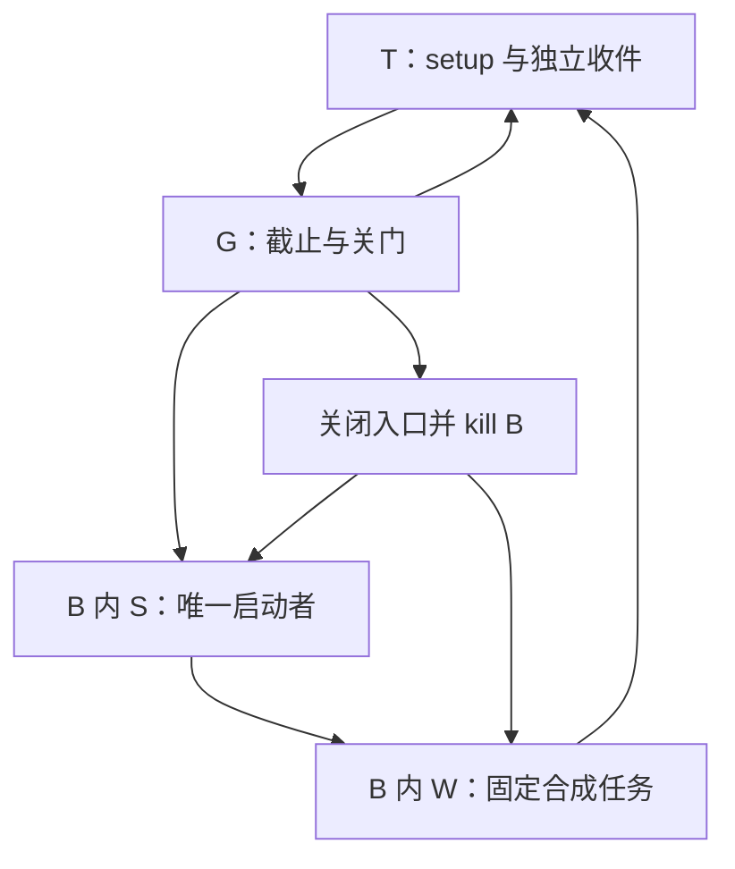

# H07 受控进程子树原语实验：架构

- Authority：Owner；状态：**PROPOSED / Gate OPEN**。
- Scope/R/输入基线见[需求](REQUIREMENTS.md)，仅 F1–F4；不是生产运行架构批准。

## 控制边界

外部收件器 T 先建立专属共同 cgroup E 和有限资源，预建控制/原双流，再启动
guardian G。E 之下有 G 叶和 B 工作子树；B 内 launcher 叶 S 与 worker 叶 W
互不包含。E/B 作为控制器父节点不放普通进程，遵守 cgroup v2 层级约束。
T 在 E 外，属于明确可信的 fixture setup/收件/最后清理边界；G 在 B 外。
T 通过 clone3 的原子入组/PIDFD 标志把 G 直接创建于 E/G，不先创建再迁移。
只有 G 能在 arming 中把 S 直接创建于 B/S，并持有 S 的原 pidfd；T 不另建 S。

这个图表示控制和证据关系，不表示 T/G 是 B 的成员。所有实际 fork 生产者
都在 B；外部 system manager 不接受实验 workload 的启动请求。
G 的实现只能在 arming 中创建 S 一次，之后 G/T 均无向 B 注入进程的代码路径，
不写 B 的 cgroup.procs，也不把控制 FD 交给外部请求者。
G 保持不可逆状态，T 不恢复死亡 G、不重建同例 B，也不复用旧 cgroup FD 起新任务。
外部可信管理员恶意向 B 注入属于信任边界失效，不能声称 cgroup.kill 永久锁住目录。

## 原语、权限与来源

1. C11 小型 helper 通过 Linux syscall 使用 clone3、pidfd、timerfd、poll/waitid；
   不增加第三方运行库，不经 shell/systemd-run 转发 workload。
2. T 仅在受审专属分支设置 cpu/memory/pids 控制；祖先缺控制器就 UNSUPPORTED，
   不改共享 root `cgroup.subtree_control`。专用 UID 无 home、附加组或 sudo 配置。
   G/T 的 setup 权限不传给 S/W；它们清空 capabilities，设置 NNP。
3. S 以 held cgroup FD 直接 clone 到 W 叶，并同时得到原 pidfd。setup 仅赋予
   专属 UID 对 B/cgroup.procs 与固定 W/cgroup.procs 的必要写资格，保留其余
   root 所有控制文件/目录，不委派 E、G、外部祖先或任意建组权限。
   held FD 本身不授予 clone 资格；需同时核对目标/共同祖先权限及实际内核约束。
   S 不持这些 procs 文件 FD，过滤后不能重开，目标仅为受审代码中的 W held FD。
   无法在此有限权限下成立就 UNSUPPORTED，不加宽 chown 或回退先创建再迁移。
4. 控制通道为 arm 前建立的单个 Unix seqpacket 端点；S 经该准确 FD 的
   SCM_RIGHTS 交付原 pidfd。消息按长度、序号、角色和 FD 数量核对；截断或多余
   FD 关闭并记失败。缓冲区中尚未收件的 FD/消息也纳入关门和收尾；只允许
   原 clone pidfd，不能携带 cgroup/任意文件 FD。预建 socketpair 的 SO_PEERCRED
   是创建时事实，不能当作继承端点后的 S 身份；以原 S pidfd 和准确 FD 继承链绑定。
5. S 只持自己的控制端、只读时钟/必要 cgroup FD 与限定流；W 不继承控制或
   cgroup FD。关闭所有未登记 FD。S/W 的 seccomp 禁止新建/连接外部 socket、
   exec、setns/unshare、ptrace、外部进程内存修改、挂载及 open/openat/openat2，
   防止重新取得 cgroup 或 /proc 中其他进程的 FD。S 的 sendmsg/recvmsg
   仅允许预建 control FD；write 仅许登记的原流 FD。W 固定 fork 对照仅继承本组，
   进一步拒绝 clone3 和控制通道发送。过滤明确 x86_64，拒绝 x32/未知 syscall。
   具体 syscall 白名单按准确 x86_64 helper 固定，禁止不支持时无过滤降级。

权限缩减在任何合成 payload 启用前完成并由 T/G 核验。仅 NNP 或路径字符串
不是外部 manager 不可达的证明；端点、继承 FD、syscall 路径和原生权限一并检查。
S 是可信固定代码，协议没有任意文件、FD、命令、unit、cgroup 或 deadline 参数。
过滤器不能解引用 clone3 参数结构来核对目标，因此 S 的固定代码和唯一 W FD
是明确的信任前提，不能把 seccomp 描述成已经独立证明所有 clone3 参数安全。
顺序固定为：预建/打开全部必要 FD → G 原子入组/双钟武装 → S 原子入组/降权/
S 过滤 → clone W → W 关闭继承控制 FD 并增加严格过滤 → 固定 payload。

## 协议与状态

控制帧固定版本 1、例号、严格递增序号、固定命令枚举及 bounded 整数参数；
每帧 ≤256 bytes、每例 REQUEST ≤8 帧、所有方向控制帧合计 ≤128 帧，
无调用者选择的路径/argv。例号绑定一次 runner
run/attempt、准确 D、fixture boot 和本例双钟；不能从重复命令得到新 epoch。
仅支持 ARM、固定用例 REQUEST、BARRIER_RELEASE、CLOSE；身份回执绑定原请求序号、
pidfd 移交及首次入组事实。重复/乱序/跨例/截止后帧拒绝，不能重发创建。

`SETUP → ARMED → OPEN → CLOSE_REQUESTED → FENCED → REAPED` 是成功路径。
任何不足转 `UNSUPPORTED`（尚未运行）或 `UNKNOWN_RETAINED`（副作用可能发生）。
原例无回到 OPEN 的路径。`CLOSE_REQUESTED` 是控制决定；`FENCED` 是后来取得的
分别核验的事实，二者时间不可混写。

G 在创建 S 以前固定 MONOTONIC/BOOTTIME 原点与同一 20 秒截止；开始接收以前
武装两钟的绝对定时通知。保留最后 3 秒停止观察，17 秒后不再接收 REQUEST。
每个 guard 检查 boot、两钟和剩余量，不能仅等一次 timerfd；暂停/失联/无法按时
收尾时如实失败，不将事后完成补记为按期。timerfd 是通知，不是内核自动 kill。

关闭顺序：G 先永久拒绝新 REQUEST，再写准确 B 的 cgroup.kill，包含 S 和全部 W；
身份回执端仍作有界 drain，仅登记/关闭排队 pidfd，不据回执创建任务；不能为了
关门提前丢弃身份通道。控制队列收件完毕/EOF 与 workload 原双流 EOF 分开记录。
收集 S 原 pidfd 退出、B recursive populated=0、原流 EOF 及已收到的 worker
pidfd 结果。所有 producer 已灭且可信外部边界不再注入，才形成局部 FENCED。
不能由一次 kill 写成功、单个 PID 消失或空树观测单独设置它。

S 的 clone 成功但回执/FD 移交丢失时，B 仍是清理对象。整树清理证据与逐实例
身份完整性分别输出，后者保持未知；T 不按一个晚来的数字 PID 伪造原 pidfd。
所有本地持有的原流写端必须按设计及时关闭；不能靠关闭读端制造 EOF。
移交 worker pidfd 不改变亲子关系：S 正常时负责 waitid/waitpid 并回传原结果，
G 可独立 poll 原 pidfd 观察退出，但不能因此直接取得非子进程的 exit status。
G/T 在创建下一层前设置 subreaper，只用于最后回收确已收养的后代，不能将
后来的收养结果回填为原 S/G 已封存结果。ECHILD 或缺失结果保留未知，不把
pidfd 可读、树空和退出码混写。

## 证据与失效

T 保存每例实际开关门时刻、syscall errno、held cgroup 身份、原 pidfd/退出、
原流长度与 EOF、资源 counters、身份缺项及清理事实。G 最终摘要仍不能自证
退出；T 在收到它以后独立核验 G 原 pidfd 和 G 原流 EOF。
未收到完整摘要时不合成它。负例的“预期错误正确”与“监督事实完整”分开计数。

G 崩溃后，由 T 只对预登记 B/E 进行最后清理；这仅给出 cleanup 事实，不能补成
G 已形成 FENCED 或实验任务原期限内闭合。无法确认清理即停止整个 job 的后续
病例，保留未知，不先删除对象/复用名字。托管设施最终销毁也不补运行证据。

可信 OS、T 和精确 helper 的失效范围明确保留；不递归要求无限监督器。
资源和输出界见需求；旧文件系统峰值与完整 Q2 账单仍不由本实验证明。

## 与现有代码的区别、采用与否决

既有 `tools/local_hand_jobs/broker.py::_guard_start` 只保护登记的短 Popen；
`runner.py::_SystemdExecutionCore` 后续仍交给外部 systemd manager。
这里的研究变量是**全部启动者都在可终结子树且没有外部请求队列**，不是再做
一次配合式 API guard。旧 broker、runner、Q2 runtime 全部保持原版本。

如必须把 workload 交回外部 manager、允许 S 迁出 B、先运行后迁移、或只能用
事后字符串 PID 回收，就否定本候选，不能暗换原语继续称通过。
实验源码不进入 wheel/Plugin/production loader。未来采用需要重新解决真实角色
权限、绝对远端保护、跨钟、五父域、审计、预算与旧 batch 约束；局部成功不批准迁移。

一手接口依据：[cgroup v2](https://docs.kernel.org/admin-guide/cgroup-v2.html)、
[clone3](https://man7.org/linux/man-pages/man2/clone.2.html)、
[pidfd](https://man7.org/linux/man-pages/man2/pidfd_open.2.html)。
这些支持接口机制，完整组合及准确 runner 能力仍待 F1–F4 验证。
