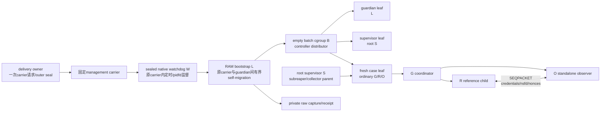

# Q2 namespace fixture 完整交付：架构

- Authority：Owner；状态：**PROPOSED / Gate OPEN / AWAITING OWNER**。
- Scope：`LH-Q2-NAMESPACE-FIXTURE-DELIVERY-v1`；拟关闭 **F0–F4 only**。
- [需求](REQUIREMENTS.md) → 本文 → [实施计划](IMPLEMENTATION_PLAN.md)；R 与需求一致。
- 本文设计专用 isolated fixture 路径；Owner B/C 前不生成源码、fixture或现场请求。

## 责任拓扑

delivery owner 在 guest 外先持久登记唯一 intent、outer UTC not-after、bundle/plan摘要和一次发行
状态，再通过固定 carrier 发出一个有界 RAM bootstrap。carrier只传输本范围；旧 Q2 window、
reservation、P4和正常任务执行权均不复用。回复丢失不产生第二次请求。

carrier顶层命令只执行已存在且封存的native watchdog W。W在任何L/B/fixture mutation前建立
跨exec的initial CPU hard guard和不可刷新BOOTTIME wall guard，以唯一`clone3(CLONE_PIDFD)`创建L，并是L全生命期的
准确parent。W自身对outer stdio零读写，以pidfd监督L、传递有界graceful stop、到期SIGKILL和原wait；
owner所见remote status是W的状态，只有封存的W映射加W status 0才证明原L为`CLD_EXITED/0`。

L 是 guest 内独立 guardian。它先处于只读bootstrap，取得
同连接`BATCH_RELEASE`后才创建对象。运行阶段L通常位于guardian leaf；每个动作commit最多一次
短暂迁入原carrier、取得owner durable ACK并迁回，最多37次，动作只在迁回并复核后放行。S完全
收口后L按实际0或1次迁移达到carrier，导出结果并执行cleanup continuation。S位于独立supervisor leaf；L持S
pidfd、每个case的原pidfd和held cgroup fd。S失败、carrier EOF或deadline到达时，L仍可停止
case和S。L不能为自己的最终退出/双流自证；delivery owner保留W remote status、
local client wait和两条OS EOF。

S 设置`PR_SET_CHILD_SUBREAPER`，负责每case context、fresh leaf、原子child创建、G/R/O收件和
typed wait。G/R/O的namespace关系只能由held kernel FD与活体交换产生，不能由L/S JSON自报。

## 固定输入和一次发行状态机

Public source不含guest、UID、path、anchor、CPU或carrier默认值。私有plan只允许封闭字段和
source-role枚举，不能借自由字符串增加读取来源或额度；它至少固定：

- R/A/B/C、预期D和bundle/source schema；唯一batch ID、N01–N12顺序及派生basename；
- 唯一Q1 guest、预期boot、历史Q2 ordinary账户/主组、完整groups、allowlisted user manager及
  旧roots/ledger/失败实例的摘要和只读/禁止修改表；
- management carrier、`env-bash-literal-ssh-v1` wrapper/profile SHA、远端login shell/parser、
  sudo/env/W/runtime绝对对象、W的source→binary/ELF/loader/`DT_NEEDED`/资源/退出映射摘要、
  W不可刷新BOOTTIME deadline及wake/kill/reap margin、RAM bootstrap bytes/SHA、
  outer owner原REALTIME/BOOTTIME/紧邻MONOTONIC及
  各自≤840s绝对deadline、输入帧上界、
  client/capture/stop责任、L原carrier leaf身份和不可重发标志；
- 已有runtime、动态库/stdlib import closure、Linux x86_64 LP64、clone3/prctl/pidfd/cgroup ABI；
- root-only cgroup2 anchor的mount ID/dev/inode/owner/mode/ACL来源、允许controllers和无其它writer
  证明；固定CPU和NUMA mems；
- `/run` stage父mount、owner/mode、≤8个bundle basename/size/SHA、固定64KiB `action.journal`、固定
  752KiB `result.journal`及其准确offset布局，以及N01–N12十二个预分配intent/context basename/schema/固定size；
- guardian期fd1/fd2零write、最多37个action carrier往返、按实际0或1次final carrier进入、每次held身份/
  membership门、outer counter/digest、owner capture+fsync ACK及最终双stream marker schema；
- journal/audit/capture设备、配置上界、并发条件和完整physical-dedup预算。
- W的固定fd/signal/rlimit/clone3/waitid状态表、W0/三个absolute deadline、
  `W_WAKE_TO_PIDFD_KILL_OVERSHOOT_NS`、`W_KILL_TO_REAP_MARGIN_NS`、
  `W_REAP_TO_REMOTE_STATUS_EOF_MARGIN_NS`和原carrier同时容纳parent/W/L的任务与物理费用。

状态只追加：

`DECLARED → LOCAL_VERIFIED → DELIVERY_ISSUED → HELLO_VERIFIED → BATCH_RELEASE_ISSUED → BATCH_RELEASE_ACCEPTED → LIVE_ADMITTED → STAGED → RUNNING → SUPERVISOR_CLOSED → FINAL_CARRIER → RESULT_EXPORTED → CLEANUP_EXEC → SEALING → SEALED`

顶层状态保持单调。每个`action_i`另有不回退子状态：`EMPTY → JOURNALED → CARRIER_ENTERED →
OWNER_COMMITTED → GUARDIAN_REENTERED → SLOT_SEALED → RELEASED`；任一中断进入该项唯一terminal
error并锁定整批UNKNOWN，不能把迁回写成顶层状态回退。

发行账固定为五组字段：`fixture_delivery_issued`在首次carrier request前为false、请求发出即为true；
`fixture_batch_release_issued`在同连接late-start/clock/费用门通过后、写出任何`BATCH_RELEASE`字节前由
owner持久置true；`fixture_batch_release_accepted`只有L收齐并严格验证完整frame后才在RAM置true并先输出
`BATCH_ACCEPTED`，owner只有取得该原frame或后续同一状态链证据才登记true；
`batch_release_outcome=NOT_SENT|CLEAN_REJECTED|ACCEPTED|UNKNOWN`独立记录结果；
`fixture_native_batch_issued`在首个case的`clone3`调用前置true，并以每case的
`clone_issued/exec_go_issued/g_go_issued`动作前journal→owner fsync→ACK链细分；
`fixture_qualification=NOT_RUN|BLOCKED_RETAINED|UNKNOWN_RETAINED|FAILED_RETAINED|FIXTURE_LIVE_REFERENCE_MATCHED`
记录最终资格。所有issued位短写、断线或回执丢失后仍保持true且不得重发。

`batch_release_outcome`初值为`NOT_SENT`。owner只有把原`BATCH_ACCEPTED`或证明同一RAM accepted状态的
后续链证据append+fsync进固定private capture，才持久登记`fixture_batch_release_accepted=true`和
`batch_release_outcome=ACCEPTED`，且须发生在允许任何native-batch动作前。`NOT_SENT`只能单调进入
`CLEAN_REJECTED`、`ACCEPTED`或`UNKNOWN`之一；任一终态不得回退、互换或由迟到ACK改写。release已
证明accepted后的业务失败只更新`fixture_qualification`，不改写outcome。

delivery已发而release未发，或release已发但L给出完整clean rejection时，只有同一原连接的完整
`CLEAN_REJECTED` frame、sealed W mapping与W remote status 0证明原L为`CLD_EXITED/0`、原local client
wait 0、双流真实EOF及准确账目全部闭合，才可写`batch_release_outcome=CLEAN_REJECTED`并进入
`BLOCKED_RETAINED`；后者仍保留issued=true。
W是唯一remote status来源，L自报exit或单独EOF不能替代。issued但accepted与上述clean rejection均不可证时，
`batch_release_outcome=UNKNOWN`并进入`UNKNOWN_RETAINED`。已发动作但身份、退出、EOF、final peak或账目不完整进入
`UNKNOWN_RETAINED`；证据完整但case关系不成立进入`FAILED_RETAINED`。不能删除intent、换ID、
回填较晚ACK或把同批未用case变成第二个batch。

远端动作位使用单独的pre-action commit链，不能只存在于RAM或tmpfs。每项在写journal前和完成
excursion/slot seal后都读取`CLOCK_PROCESS_CPUTIME_ID`、耗尽signalfd并核对pending；累计必须<19s且
无observed/pending `SIGXCPU`，否则不进入或不放行动作。`fixture_native_batch_issued`
及每case的`clone_issued/exec_go_issued/g_go_issued`最多37项；每项由S向L请求，唯一L写者在guardian内
把≤1KiB、含单调counter/previous digest/intent digest/action的记录按准确offset/length pwrite到固定
`action.journal`的下一个EMPTY slot并`fdatasync`。写journal使用的临时FD须先关闭；L随后从held
对象复核原carrier leaf，向其
`cgroup.procs`写`0`，再从held procfs/cgroup视图证明自身实际membership；随后把同一记录经outer
stdout单次写给delivery owner，stderr为零字节。owner只有把记录append并
fsync到预先固定的private capture后才经原stdin回≤256-byte
`ACTION_COMMITTED(counter,digest,capture_head)`。L验证并耗尽ACK后，重验held guardian、只写`0`
迁回并复核membership，再把本次前后身份、钟、流counter/digest、ACK、累计carrier CPU/cost和结果
写入对应4KiB excursion slot并`fdatasync`、关闭临时result FD，最后才经现有control放行S。slot按阶段字段写入；迁出、
write、ACK或迁回失败也须在L当前所在域封口唯一错误状态，能封口却未封口同样UNKNOWN。ACK/write
失败时L留在carrier进入terminal stop；迁出失败时留在guardian有限stop；迁回失败时留在carrier
且不执行动作。整个迁出、membership、write、owner fsync/ACK、迁回、membership和slot seal必须在
≤2s及原期限内完成；owner已经接收的issued记录保持consumed；任一步都不重试、不刷新期限。
tmpfs fsync只提供本session本地一致性，不能替代owner durable ACK；该链复用既有FD和预触达buffer，
受原work/case期限及全批carrier累计费用约束，不生成第二个发行通道。

L的CPU归属只以同一进程连续的`CLOCK_PROCESS_CPUTIME_ID`为主账。F0固定该clock的语义、
`clock_getres`及向上舍入量`CPU_SAMPLE_ROUND_NS`；在初始carrier、首次guardian进入，以及每次
经held视图验证的guardian/carrier membership边界都取样。明确位于某域的相邻样本delta连同
`CPU_SAMPLE_ROUND_NS`计入该域；migration syscall开始到新membership验证之间的歧义delta连同
`CPU_SAMPLE_ROUND_NS`同时计入guardian和carrier，
绝不以`process−guardian cpu.stat`反推carrier。37个excursion slot和第38 slot保存各自固定边界
样本/累计值，另形成全序样本摘要；guardian `cpu.stat`只作独立上界交叉核对，不能替代该主账或
抵扣迁移双计。

F0还冻结全部L段的有限catalog；每项给出process及guardian/carrier双计后的硬CPU envelope，并冻结
`STOP_CPU_MAX_NS[GUARDIAN,CARRIER,PROCESS]`、`FATAL_DELIVERY_OVERSHOOT_NS`、
`RLIMIT_CPU_KILL_OVERSHOOT_NS`、`EXEC_GUARD_DELIVERY_OVERSHOOT_NS`、
`initial_exec_gap_cpu_ns/initial_exec_gap_wall_ns`、`cleanup_exec_gap_cpu_ns/cleanup_exec_gap_wall_ns`及
`CLEANUP_PREPARSE_CPU_MAX_NS=CP_MAX_NS`。目标必须证明`INITIAL_CPU_SOFT_S=8`、
`INITIAL_CPU_HARD_S=9`、`0≤RLIMIT_CPU_KILL_OVERSHOOT_NS≤1s`且
`9s+RLIMIT_CPU_KILL_OVERSHOOT_NS≤10s`；cleanup另须有
`0<EXEC_GUARD_DELIVERY_OVERSHOOT_NS<CP_MAX_NS<cleanup_exec_gap_cpu_ns`与
`0<FATAL_DELIVERY_OVERSHOOT_NS<CP_MAX_NS`。

W在唯一clone前把SIGXCPU设为`SIG_IGN`并设/readback CPU `(8,9)s`；L出生即继承该累计限制，
soft 8s不产生core/helper，不可捕获的hard 9s SIGKILL加已资格化overshoot把initial
carrier CPU物理风险封闭在10s。L首个user-code必须先取process sample，核准确W parent、
`PDEATHSIG(SIGKILL)`、`Threads=1`、CPU `(8,9)s`和SIGXCPU ignore，在任何timer前完成
Q0/RLIMIT_SIGPENDING，再把SIGALRM设为unblocked/`SIG_DFL`、建立/arm/readback fatal
process-clock timer并紧邻复测。guard active且复测仍在候选界内后，L先block SIGXCPU、恢复/readback
`SIG_DFL`，创建/readback接收`W_BLOCKED_SET+SIGXCPU`的signalfd并drain/核pending；只有无stop/XCPU
且目标root `CAP_SYS_RESOURCE`已资格化，才把CPU提高/readback为供S继承的`(20,100)s`，随后立即再次
drain并核pending。W放行至该门的
`initial_exec_gap_wall_ns`只是admission/success界；从L出生开始的远端wall强制由W的
不可刷新BOOTTIME deadline承担。W ELF入口至guard arm的pre-carrier TCB prefix单独列账，
不声称已有远程kernel hard wall。

正常段由一个`CLOCK_PROCESS_CPUTIME_ID` POSIX timer以未block/`SIG_DFL`的SIGALRM
fail closed。cleanup exec前另以尚可信账本计算最早carrier/process physical与success候选：
将SIGPROF设为unblocked/`SIG_DFL`，按向下量化且不推迟expiry的固定规则设/readback
`ITIMER_PROF`，同时保守向下取临时整数`RLIMIT_CPU` soft/hard backstop。两者都跨
`execve`保留；continuation只能在preparse SIGALRM guard和按H完整ledger的fatal guard均已
active/readback后，凭已资格化CAP恢复`(19,20)s`，再disarm/readback `ITIMER_PROF`并核
SIGPROF无pending。cleanup wall gap同样只是admission/success界，zero-CPU loader stall仍由W封闭。

进入任一可返回或可失败段前，必须对`GUARDIAN`和`CARRIER`分别证明
`accum[domain]+segment_envelope[domain]+STOP_CPU_MAX_NS[domain]≤10s`，并对`PROCESS`证明总量≤20s；
否则不进入，只执行已预留的stop catalog。仍可通向success的段还须证明完成该段、
全部剩余段及`TC_MAX_NS`后guardian/carrier/process分别≤9s/≤9s/≤18s。这些10s是
物理CPU风险界，不只是事后验收；guard/catalog/overshoot不能资格化即在F3 mutation前BLOCKED。

每段进入和每个verified membership边界都从同一process sample `Pnow`重算`TIMER_ABSTIME` fatal
expiry。候选包括本段全部适用domain/process envelope、`limit-accum-STOP_CPU_MAX_NS`（域10s、
process 20s），以及success路径的
`success_limit-accum-remaining_success_envelopes_after_segment-tail_reserve`（9s/9s/18s，tail向量
`[0,TC_MAX_NS,TC_MAX_NS]`）；迁移歧义同时采用guardian/carrier候选。取最小候选后扣
`FATAL_DELIVERY_OVERSHOOT_NS`并readback。最小余量不大于overshoot、正常最坏CPU不能严格早于
expiry、arm/readback失败或signal wait都在进入前BLOCKED/运行中锁UNKNOWN；费用计入segment envelope。

协议等待不使用blocking I/O。F0固定guest outer fd0/fd1/fd2、全部internal pipe/socket及owner所持
local client stdin/stdout/stderr端的真实类型；各端在协议前设置/readback `O_NONBLOCK`。guest actor以
单线程`ppoll`状态机同时观察当前I/O、signalfd/stop source和pidfd。owner也以单线程poll状态机同时
观察三条client pipe、client pidfd/wait和三个nonblocking/CLOEXEC timerfd；timerfd以
`TFD_TIMER_ABSTIME`分别绑定原REALTIME/BOOTTIME/MONOTONIC outer deadline，REALTIME使用
`TFD_TIMER_CANCEL_ON_SET`。owner在启动local client前按固定顺序创建、absolute arm并readback三者，
任一失败不得启动client。owner持续并行drain stdout/stderr，每流独立offset/counter/digest，只在
stdin可写时推进当前frame remainder；frame先完整append+fsync private capture才可ACK，禁止单流
阻塞顺序造成SSH/channel反压。owner固定FD峰值/费用单列，不混入guest表。L创建三个不占FD并共用
plan-fixed blocked realtime `DEADLINE_SIGNAL`的POSIX absolute timer，
分别使用CLOCK_BOOTTIME、CLOCK_MONOTONIC和CLOCK_REALTIME；连同唯一
`CLOCK_PROCESS_CPUTIME_ID`/SIGALRM fatal timer，只允许initial与cleanup-continuation两个固定generation，每代仅有按固定顺序排列的四个
`timer_create` call site且同时live≤4。success-capable完整路径在每代建成四项、总计八次create；任一
失败路径只能停在对应固定序列前缀，且全生命周期create≤8。任一generation第五个live timer、固定
两组之外的额外create或第九次create均拒绝。
每次rearm先把
`UTC_not_after-now_REALTIME`按已封存offset/skew/drift最坏界映射为BOOTTIME与MONOTONIC cutoff；
两个timer都取`min(original_absolute_deadline,mapped_UTC_cutoff)`，REALTIME timer取原UTC not-after，
因此REALTIME后退也不能延长双钟保护，前跳由REALTIME timer唤醒。F0固定
`SIGPENDING_TIMER_RESERVATIONS=4`、`SIGPENDING_EVENT_MARGIN=4`；L在任何timer创建前从已资格
`/proc/self/status`的`SigQ`读取同一real UID当前占用`Q0`及原limit并确认非本协议占用不漂移，在
initial generation第一次`timer_create`前把RLIMIT_SIGPENDING设为有限`(Q0+8,Q0+8)`且readback。initial按fatal/
BOOTTIME/MONOTONIC/REALTIME逐个创建并核对`SigQ=Q0+1…Q0+4`；三个wall timer创建时先disarm，
BOOTTIME/MONOTONIC立即arm至G0+48s，REALTIME在DECLARE验证前保持disarmed，随后三者才按原绝对
期限和UTC cutoff rearm。cleanup exec前耗尽signalfd并确认全部blocked stop/deadline pending为空，
再arm/readback不占POSIX timer配额的`ITIMER_PROF`和临时整数RLIMIT_CPU backstop。continuation首码
按P0→`getitimer(ITIMER_PROF)`核remaining/SIGPROF→继承FD4的`Threads=1`→临时RLIMIT readback顺序，
再按sealed preparse公式重建fatal timer并立即排空继承signalfd、要求`SigQ=Q0+1`。严格验H、
取P1并按完整ledger首次rearm/readback后，才恢复RLIMIT_CPU `(19,20)s`、disarm/readback
`ITIMER_PROF`并核SIGPROF无pending；随后重建三个wall timer并逐项核至`Q0+4`。旧event一律stop。
四项reservation加四项pending-event margin也覆盖exec竞态中最多三个旧wall event加一个新fatal
reservation。create/arm/readback、Q0或额度资格在F0/F2静态失败，或initial generation在首mutation
前失败时BLOCKED/CLEAN_REJECTED；accepted或已mutation后的运行故障与cleanup generation故障只能
锁UNKNOWN并有限收尾。任一generation第五个live timer或固定八次之外的create源码路径必须在F2或
首mutation前BLOCKED；wall timer到期由signalfd唤醒。每次wake、
EINTR和partial I/O前后重采三钟并验证无step；不能用一个MONOTONIC relative timeout，因为suspend后
BOOTTIME可能已过。

状态机的frame/chunk/buffer表由manifest封存。partial read及manifest允许chunk/remainder的大frame
write只推进当前logical frame remainder；deadline/stop/error后永久锁UNKNOWN，不能从frame头重发。
小action/marker/ACK/BEGIN不超过actual qualified atomic-write bound：写前零字节EAGAIN可回poll，
raw write一旦发生必须全写，partial即UNKNOWN；752KiB result和≤32KiB `CLEANUP_FINAL`按固定≤4KiB
chunks携counter/digest；最终success frame仍单次≤512 bytes、EAGAIN或非全写即失败。pipe满、单流反压而另一流有数据、停读、stdin并发
partial、EAGAIN、EINTR、EOF、signal、suspend/resume、owner timerfd到期/REALTIME cancel和client
exit均必须使48/2/15/5s及work/containment原界按双钟到期，process-CPU timer不替代墙钟。

## carrier late-start gate

RAM bootstrap source≤32KiB，编码为唯一无padding base64url `TOKEN`。既有
`env-bash-literal-ssh-v1` host wrapper接收一个由`shlex.join`产生的准确远端command string：

`exec /usr/bin/sudo -n -- /usr/bin/env -i LANG=C LC_ALL=C ABS_WATCHDOG WATCHDOG_ARGS -- ABS_RUNTIME -I -B -c FIXED_LOADER TOKEN`

预先固定的远端login shell以`-c`只解析一次；`exec`消除shell等待层，绝对sudo/env/W/runtime、
固定flags/loader和只含`[A-Za-z0-9_-]`的TOKEN不接受自由命令。完整UTF-8 command≤48KiB。
F0/F2以wrapper/profile SHA、准确shell路径/版本/模式、sudo policy输入、`shlex.join`字节、
shell parse后argv和反向round-trip证明只得到预期argv，且sudo产生root W、`env -i`
使W/L只见准确env。`-c`从argv取TOKEN而不消费stdin；没有guest路径fallback或systemd调用。
发request前还须从授权固定来源证明`core_pattern`非pipe，并固定W absolute path、mount/dev/inode/
size/uid/mode/不可写祖先/SHA/version/ELF/PT_INTERP/loader/`DT_NEEDED`/source→binary、caps/
securebits/seccomp/LSM/affinity/scheduler、argv/env/cwd/umask、资源表和退出映射。在request前已证W不匹配才是
`NOT_ISSUED`；若只能在已发SSH后发现，delivery保持consumed并按证据归BLOCKED/UNKNOWN。

F0还固定host env/PATH/cwd、实际解析出的env/bash/ssh、identity和known_hosts对象；known_hosts
必须已经含准确host key，`accept-new`不得在本批采用或写入新key。它们的read/metadata/audit成本
纳入pre-carrier prefix；launch env明确删除`SSH_AUTH_SOCK/SSH_AGENT_PID`，使认证只使用固定
identity file；identity、key、agent状态或解析对象不符即不发请求。

该门还须固定并证明：local wrapper不读stdin且不重定向，SSH没有PTY且stdin二进制透明、stdout/
stderr保持两条独立pipe；ForceCommand、authorized_keys command/environment、`~/.ssh/rc`、
`/etc/ssh/sshrc`、BASH_ENV/ENV、startup/bashrc hook、sudo `use_pty`/I/O plugin/lecture/password不会
消费、注入、重定向、合并或替换协议stdio/argv/env。`env -i`发生在这些层之后，不能替代此证明。
预算内认证、audit/journal和session metadata允许但须单列；任一协议影响未知或额外协议字节均
`NOT_ISSUED`，不得放宽framing来过滤banner。

W的ELF入口到guard arm是明确列账的pre-carrier TCB prefix；F0必须从封存source/loader/
launcher关系和独立fault/trace固定`W_PREFIX_CPU_MAX_NS≤1s`、`W_PREFIX_WALL_MAX_NS≤2s`、单task、
userspace AS/RSS及保守物理风险≤64MiB、入口installed FD≤8、outer read/write=0和全部kernel/
audit费用。这些都进入首次发行前carrier预算；wall值只是endpoint premise下的admission envelope，
不冒充kernel hard wall。W唯一clone前不存在L、B或fixture mutation。

W入口先取absolute process CPU样本，按`parent_before=getppid()`→设/readback
`PDEATHSIG(SIGKILL)`→`parent_after=getppid()`证明两次都是同一非1且已按manifest资格化的
parent。它先把完整signal mask归一为空，把catchable dispositions归一为manifest初态：
SIGXCPU=`SIG_IGN`，SIGCHLD/SIGUSR1/HUP/TERM/INT/QUIT/`DEADLINE_SIGNAL`=`SIG_DFL`，清除
SIGCHLD的`SA_NOCLDWAIT/SA_NOCLDSTOP`。逐项readback后再block/readback
`W_BLOCKED_SET={SIGCHLD,SIGUSR1,SIGHUP,SIGTERM,SIGINT,SIGQUIT,DEADLINE_SIGNAL}`，signalfd只接收
该set。W核fd0/1/2类型/flags，`close_range(3,UINT_MAX,0)`后核恰好stdio，设/readback
CPU `(8,9)s`、AS/DATA `(64,64)MiB`、NOFILE `(8,8)`、CORE/FSIZE `(0,0)`、STACK `(8,8)MiB`及
固定零limits，然后创CLOEXEC signalfd=3，取W0 BOOTTIME并创/absolute-arm/readback
CLOEXEC timerfd=4。

固定`W_REMOTE_EXIT_DEADLINE=W0+830s`。manifest分别固定
`W_WAKE_TO_PIDFD_KILL_OVERSHOOT_NS`、`W_KILL_TO_REAP_MARGIN_NS`和
`W_REAP_TO_REMOTE_STATUS_EOF_MARGIN_NS`，三者和≤12s；
`W_KILL_DEADLINE=W_REMOTE_EXIT_DEADLINE-W_WAKE_TO_PIDFD_KILL_OVERSHOOT_NS-W_KILL_TO_REAP_MARGIN_NS-W_REAP_TO_REMOTE_STATUS_EOF_MARGIN_NS`，
`W_REAP_DEADLINE=W_REMOTE_EXIT_DEADLINE-W_REAP_TO_REMOTE_STATUS_EOF_MARGIN_NS`，timerfd不可刷新地arm到W_KILL_DEADLINE。F0/F2分别
资格化timer readable→W被调度并发pidfd SIGKILL、kill→typed wait/reap、reap→W `_exit`/SSH status/EOF
的最坏margin；timerfd本身不杀进程。除D-state、W自身SIGKILL或premise失效的明确UNKNOWN外，
必须证明kill不晚于`W_KILL_DEADLINE+W_WAKE_TO_PIDFD_KILL_OVERSHOOT_NS`、reap不晚于
W_REAP_DEADLINE、status/EOF不晚于
W_REMOTE_EXIT_DEADLINE。

完成W self-gates后才用88-byte全零`clone_args`创建唯一L：`flags=CLONE_PIDFD`、
`exit_signal=SIGCHLD`、对齐pidfd storage，其余字段全零，无fork或数字PID fallback。child严格执行
PPID-before→设/readback `PDEATHSIG(SIGKILL)`→PPID-after，要求两次等于W，再自停SIGSTOP。W
`ppoll` signalfd/timerfd/pidfd；SIGCHLD ready后只用一次
`waitid(P_PIDFD,...,WSTOPPED|WNOHANG)`消费并核唯一`CLD_STOPPED/SIGSTOP`、未exit和PPID/starttime，
timer同时ready时deadline优先。SIGCONT后终态只用`WEXITED|WNOHANG`，不混入旧stop/continued event。
只在同次clone PID、live pidfd和已消费stop event共同成立时，W才用`prlimit64`复核出生起
CPU `(8,9)s`，并为stopped child设/readback AS/DATA `(64,192)MiB`、NOFILE `(32,64)`、
CORE `(0,0)`、FSIZE `(4,4)MiB`、STACK `(8,8)MiB`、NPROC及其余pair；要求已资格化W root CAP，
这不是PID migration fallback。

clone时child准确继承fd0–4；W关自身fd0–2且零outer read/write，只留signalfd/timerfd/pidfd，
随后只发一次pidfd SIGCONT。child恢复后关fd3/4，建立/readback准确L入口signal状态：mask恰为
W_BLOCKED_SET、SIGXCPU=`SIG_IGN`、其余catchable=`SIG_DFL`，并核exec前恰0–2，才exec runtime。W单线程
`ppoll`三项；child放行前的任何stop source/deadline/integrity error立即pidfd SIGKILL；放行后
signalfd收到SIGUSR1/HUP/TERM/INT/QUIT/`DEADLINE_SIGNAL`只转发一次SIGUSR1，固定grace到界才
SIGKILL；deadline/integrity error不走grace。kill后只用终态selector，以nonblocking
`waitid(P_PIDFD,...,WEXITED|WNOHANG)`/`ppoll`循环至`W_REAP_DEADLINE`；到界仍未reap即非零退出并把
child/B状态保留UNKNOWN。W只在L
`CLD_EXITED/0`、从未触发deadline/stop/error、最终absolute process CPU≤1s且早于W期限时`_exit(0)`；
其他按封存非零映射。owner所见remote status是W；只有sealed W mapping+W status 0才证L
`CLD_EXITED/0`。L可先关流出EOF，owner仍须等W status。

owner启动local client前只证W static identity/prefix/transport/资源预算并一次固定HELLO发送原点T0；
actual W PID/starttime/W0/arm record只能由clone后HELLO带回。postlaunch的HELLO/RTT/三钟/actual-W/limit/slack
门失败时不得发`BATCH_RELEASE`，delivery保持consumed；有完整clean rejection/status/EOF证据才BLOCKED，
否则UNKNOWN。W把自身snapshot以固定argv传L。L首码先读process clock，核W parent/starttime、
`PDEATHSIG(SIGKILL)`、`Threads=1`、CPU `(8,9)s`、SIGXCPU ignore、mask恰为W_BLOCKED_SET和W snapshot。
它在任何timer前完成Q0/RLIMIT_SIGPENDING，再把SIGALRM设为unblocked/`SIG_DFL`、建立/arm/readback
fatal process-clock timer并紧邻复测，立即固定G0。随后block SIGXCPU、改为`SIG_DFL`，创建/
readback只接收`W_BLOCKED_SET+SIGXCPU`的signalfd并先drain/核pending；无stop/XCPU才凭已资格CAP
把CPU raise/readback为`(20,100)s`，raise后立即再drain/核pending。其他profile由W在runtime前设好并
由L复核。L再创三个disarmed wall timer，arm BOOTTIME/MONOTONIC到G0+48s，逐项readback/SigQ；
REALTIME等DECLARE验证后才与另两者按原期限/UTC界arm/rearm。L全程保持W-bound PDEATHSIG/PPID，
SIGUSR1只是W通过pidfd转发的graceful stop。

远端wall物理backstop是W，不以initial gap或owner local kill冒充。HELLO/release门必须实证
`W0→G0≤10s`、`G0→BATCH_RELEASE≤48s`、release→containment≤760s，合计≤818s，且三段margin和≤12s；
还须证W remote status/EOF严格早于owner最早outer cutoff。owner在最早outer deadline前10s关stdin写端、
保留双读端，到原deadline只hard-kill本地client group；L以work/containment做有证据stop，W是最后
pidfd SIGKILL backstop。
在任何外部/持久mutation前，它只允许：

1. 从stdin读取一个≤16KiB、length+digest framed的`DECLARE`，严格解码预置batch、预期boot、owner
   原三钟及三个outer deadline、source/bundle摘要和随后输入上界；该frame不含自由path/command；
2. 读取boot ID、CLOCK_REALTIME、BOOTTIME及紧邻MONOTONIC，输出一个有界HELLO；
3. 在同一双向连接等待唯一`BATCH_RELEASE`；DECLARE decode、HELLO及等待完整release全都必须在
   G0+48s前完成；EOF、短帧、重复帧或该原deadline只读退出；
4. owner从T0到完整HELLO收齐的exchange≤10s，并用这个owner send/receive区间把HELLO时guest
   realtime offset的整个可能区间约束在±2s；owner和L各自核对REALTIME相对BOOTTIME/MONOTONIC
   的delta无step。F0从双方准确`adjtimex`/clocksource固定相对频率误差上界。owner三个outer
   deadline及L报告的guest UTC余量都须≥792s；owner紧邻issued动作前取得第二组REALTIME/
   BOOTTIME/紧邻MONOTONIC和同步状态，连同原点写入固定`BATCH_RELEASE` frame，再持久写issued位并
   发出该frame。这个
   已测RTT不被当作后续release单程上界；
5. L收到完整frame后，以HELLO guest realtime采样到当前release receipt的实际BOOTTIME和紧邻
   MONOTONIC elapsed及上述相对频率误差上界扩大offset区间；扩大后的当前区间必须整体仍在±2s。
   L先用owner原点→frame第二组的三钟delta和同步状态复核owner无step，再用该当前区间的最坏端
   独立要求guest UTC原始余量≥782s并证明owner当前剩余下界≥780s；同时核对guest三钟delta无step、
   双方`adjtimex`未unsynchronized，且另以固定clocksource输入证明随后760s
   最坏相对漂移≤2s。缺频率界、clock step、unsynchronized或扩大后越界均在mutation前
   `CLEAN_REJECTED`。随后从guest BOOTTIME和紧邻MONOTONIC各派生work `now+750s`和containment
   `now+760s`；成功须早于两个work clock和原UTC not-after，stop/receipt须早于两个containment
   clock和原UTC not-after。work内固定`FINAL_SUCCESS_RESERVE=110s`，不能借用随后10s containment
   完成success。160s admission/stage/S、最多480s cases和110s final-success tail恰好组成750s；
   每case在intent/leaf/action前取得同一`CASE_T0`并派生不可刷新的`CASE_T0+20/25/30/40s`；每次开始case及
   其每个pre-action门都须保留`CASE_T0+40s-current+110s`。首例四项、后续三项excursion及全部夹层工作
   共享`CASE_T0→CASE_T0+20s`，不能另起G的30s时钟。780到760的20s中最多2s给漂移，至少8s位于远端containment完成与
   owner EOF stop之间，随后还有10s到local hard cutoff；不回收余量，也不让owner字段扩大guest期限；L此时置RAM accepted并先
   输出`BATCH_ACCEPTED`，其丢失不允许重发；
6. owner在同一次issued写之后只发送一次完整`BATCH_RELEASE`，随后在同一stdin连续发送manifest中
   已承诺的length+digest bundle frames（总逻辑≤1MiB/8 files）；L接受release后可将它们读入有界
   RAM并复核，但live admission通过前仍不落盘；任一短帧/额外帧/摘要错误进入stop且不重发；
7. 除W在guard全部active后唯一clone L外，`BATCH_RELEASE`前不mkdir、open-write、
   额外fork/clone、迁移task、改cgroup或读取自由路径。

这使迟到请求即使被carrier执行，也不能在owner消失或absolute not-after后准备fixture。transport/
sshd本身可能产生的只读拒绝前缀已在发行前费用上界内；本文不把channel timeout或PDEATHSIG
写成“server从未执行”。`BATCH_RELEASE`后work deadline控制新动作和成功；到work deadline只进入
stop，containment deadline控制最后wait/empty/EOF/receipt。UTC not-after只再缩短；任一对应clock
过期即停止，containment过期不得再写成功结论。

## live admission、anchor和最小stage

L在首个mutation前集中读取固定对象：guest/boot、账户数据库、allowlisted manager及除此之外的
同UID进程、旧roots/ledger、runtime、core配置、cgroup2 mount/anchor、controller/effective
cpuset+mems、L当前carrier leaf、`/run` mount、journal/audit配置与设备、capacity和原clocks。没有“找一个可用对象”
的枚举。继续条件包括：

1. allowlisted manager准确匹配且只读；只允许F0已绑定的一个read API/source、准确字段和固定调用
   次数，不发送Start/Stop/Cancel/write，也不改用任意`systemctl`/D-Bus枚举；除此之外没有同UID
   进程、session、job或可写端点；
2. held mount经mount ID、dev/inode和`CGROUP2_SUPER_MAGIC`证明为准确cgroup2；anchor不是
   ordinary/user delegation，root-only且没有systemd或第三方管理本批派生名；它的
   `cgroup.type=domain`、`cgroup.procs`为空、`cgroup.subtree_control`准确为
   `cpu cpuset memory pids`，祖先已提供四项controller；当前`nr_dying_descendants=0`并记录准确
   live descendant基线D0。有效`cgroup.max.depth`剩余至少2层，有效descendant slots在计入D0后
   仍至少4项，足以容纳
   B及三个同时存在的leaf；L不写anchor limits或`subtree_control`；
3. kernel/runtime实际支持clone3 INTO_CGROUP+PIDFD、close_range、pidfd、nsfs ioctl、credential/
   rights、cgroup.kill、memory/pids peak、目标层可写`memory.reclaim`和所需proc/cgroup views；真实clone调用留给首个case；
4. 既有`core_pattern`不是pipe，`RLIMIT_CORE=0`不会启动leaf外core helper；
5. 固定CPU、audit/journal/capture风险、旧保留和本批peak在实际设备上可同时容纳；初始carrier
   记录已包括在pre-carrier reservation；
6. 原carrier leaf的held mount/dev/inode/type仍匹配、`cgroup.type=domain`且
   `cgroup.subtree_control`为空，`cgroup.freeze=0`、`cgroup.events populated=1/frozen=0`及
   effective cpuset.cpus/mems准确匹配plan；准确单线程W parent持续存活并留在该leaf，固定
   manager/source证明整个batch内无cleanup或改限竞态，因此该leaf可接纳L；任何held对象只经
   dirfd/openat使用，不按路径重开。该整张表在最多37个action carrier进入及需要发生的0或1次final进入的每次
   写`cgroup.procs`前后从同一held对象执行；每个action返回guardian也须从held guardian和procfs
   复核目标及实际membership；
7. 三个原deadline仍完整容纳未发阶段；不足时BLOCKED，不减case或刷新时间。

通过后，L仍留在原carrier leaf，先从已资格且全程held的`/run`父目录dirfd create-only建立root-owned
stage。完整stage manifest恰含≤8个bundle文件、一个固定64KiB `action.journal`、一个固定752KiB
`result.journal`和十二个固定16KiB case intent/context文件；所有文件均create-only并由L逐页实写，
journal/intent初值为固定EMPTY slots，不得延长、打洞或新增名称。result布局为：offset 0的8KiB
header；offset 8192起十二个48KiB case区，各含32KiB stdout、8KiB stderr、8KiB metadata；offset
598016起38个4KiB excursion区；offset 753664起16KiB terminal/global区；文件终点770048。case
metadata必须以≤8KiB固定binary schema容纳typed wait/EOF、`CASE_DRAINED`、唯一`CASE_FINAL`、最多
四轮reclaim和诊断，以offset引用同区G raw bytes而不再复制；任何schema实编码溢出均UNKNOWN，不能
截断为成功。stage最大逻辑2,080,768 bytes（2032KiB），最多22个regular、连stage目录23 inode。
只有已资格4KiB base page前提下，bundle各自page rounding的条件上界才是2,109,440 data bytes；F0/F3
仍须证明tmpfs folio/THP及metadata/dentry/xattr/allocator/sync后物理风险≤3MiB/48 inode，未知即
BLOCKED。bundle在RAM和原
输入内验SHA后写入/复读；L逐页读取准确runtime/import closure和bundle file-backed页，并在原
carrier leaf内加载、触达bridge全部允许mapping。stage tmpfs页在B外首次分配；runtime/bridge预热只
降低后续refault风险，不能证明file-backed folio永久留在B外，任何B内重新charge最终都必须由逐层
reclaim/`memory.current=0`闭合并另进共享池账。普通身份只读，S只可在预分配intent固定slot内按
准确offset/length pwrite，唯一L只可写两个journal的准确固定slot。任何目标存在、size/block/schema漂移
即拒绝，不覆盖。

stage最终从held dirfd按完整manifest逐项复核并`unlinkat(name,0)`；任何ENOENT均UNKNOWN，不枚举、
不处理额外名称。关闭stage FD后只能从同一父目录fd执行identity-safe
`unlinkat(stage,AT_REMOVEDIR)`，不得用stage自身FD删除“.”或按路径重开。任一unexpected entry使
rmdir失败并保留UNKNOWN。cleanup未知时仍按全额保留，不能把reboot或rmdir当退款。

stage和L bridge预热完成后，L才用held anchor fd、no-follow/create-only操作建立唯一B。B保持空
进程并先读回`cgroup.controllers`恰含四项。L再写/readback plan固定`cpuset.cpus`/`cpuset.mems`并核effective值，再配置/readback
`cgroup.max.depth=1`、`cgroup.max.descendants=3`、`cpu.max=100000 100000`、
`cpu.max.burst=0`、`memory.max=320MiB`、`memory.swap.max=0`、`memory.min=0`、`memory.low=0`、
`memory.high=max`、`pids.max=5`。B仍为空时，L只向**新B**的`cgroup.subtree_control`执行一次固定
token write `+cpu +cpuset +memory +pids`，再用严格set parser读回恰好四项；anchor全程只读。
L随后读取B的严格零initial schema，只有全部通过才建立guardian和supervisor leaf。每个leaf均须证明
domain、空`cgroup.subtree_control`，分别配置/读回limits及固定cpuset/effective值，并在首个task前读取
各自严格零initial schema后，以向held
guardian `cgroup.procs`写`0`自迁移并核对；迁移紧前由held procfs证明`Threads=1`，不写数字PID。
此后每个action迁出/迁回及需要执行final迁出时都重复该单线程门。全批旧carrier leaf最多38次、新guardian
最多38次self-write：初次入guardian一次、最多37次action回guardian、最多37次action入carrier及
最多一次final入carrier，合计最多76次；每次身份/期限/累计费用连续留证。

bundle全部逻辑bytes≤1MiB且最多8个regular file，其中包括一个预编译native bridge `.so`。同一artifact
除clone/fork入口外还导出setup、arm和不返回的`fixture_cleanup_tail`。manifest固定bridge C source摘要、
编译器和flags（禁用非确定build-id）、CPython major/minor/SOABI、ELF class/machine、允许`DT_NEEDED`
与动态loader对象摘要、完整导出符号、fixed receipt/digest/signal/write/close/exit合同和source→binary关系；两个干净隔离
build须byte-identical并与交付SHA一致。F3再把目标runtime/loader/library实物与manifest逐项匹配。
cleanup exec不继承旧mapping。continuation在已验证carrier从stage artifact复制到新的sealed executable
memfd：manifest固定`memfd_create` flags、最大size、copy/page-touch/digest顺序、四个seal及procfd loader
合同。原artifact FD和memfd同时最多2个；复制后先关原artifact，再从memfd资格化/load并关memfd，
mapping留至`_exit`。这样tail mapping来自只在carrier首次分配/触达的新inode；payload逻辑/RAM/AS≤1MiB；含folio/THP/metadata/allocator的瞬时物理风险≤2MiB/1 shmem inode，copy/load CPU和file-backed/shared charge全部计carrier/shared，不能用stage预热抵扣。
guest没有compiler/headers且不得现场build或重新link；kernel exec/seal policy或任一artifact关系不符时
在加载bridge前BLOCKED/UNKNOWN。

W及B内四层资源合同固定如下；所有limit配置后立即复读，final值在对应树空且rmdir前取得：

| cgroup/process | rate与hard limit | final acceptance |
| --- | --- | --- |
| remote watchdog W / 原carrier聚合 | W单线程，至L退出全程只多一个task；B的`pids.max=5`不含W，原carrier必须同时容纳既有parent/W/L。W从进程出生累计的RLIMIT_CPU在guard arm时设/readback为`(8,9)s`，F0另资格化`W_PREFIX_CPU_MAX_NS≤1s`；guard前userspace AS/RSS及保守物理风险≤64MiB、入口installed FD≤8，guard后AS/DATA hard≤64MiB、STACK≤8MiB，image/shared/kernel objects也闭合在同一64MiB内。entry→close_range峰值≤8；guard后pre-clone installed=5，clone返回pidfd后基础6，串行proc FD使峰值≤7；child stop时继承0–4，resume后关3/4并核恰0–2；W关0–2后steady=3 | hard-kill加已资格overshoot使W完整失败CPU风险≤10s，W status 0还绑定最终absolute process CPU≤1s。L carrier≤10s是独立process-clock账，W不混入且原carrier `cpu.stat`不冒充L账；aggregate新CPU风险≤20s。W的64MiB与carrier/shared pool默认相加，task/FD/slab/pipe/audit均单列。W0后不可刷新cap≤830s，wake→kill、kill→reap、reap→status/EOF三段margin和≤12s；`W_PREFIX_WALL_MAX_NS≤2s`只是endpoint premise下的admission envelope |
| empty B | 固定cpuset.cpus/mems及effective值；CPU `100000/100000`, burst 0；memory 320MiB/swap 0/min 0/low 0/high max；pids 5；空procs时唯一启用`cpu cpuset memory pids`给children | subtree-control严格恰四项；usage≤170s、memory.peak≤320MiB、pids.peak≤5；子层清完后reclaim且memory.current=0 |
| guardian leaf / L | domain、空subtree-control、固定cpuset/effective值；CPU `20000/100000`, burst 0；memory 64MiB/swap 0/min 0/low 0/high max；pids 1；L由W在runtime前取得AS/DATA(64,192)MiB、NOFILE(32,64)、FSIZE4MiB，initial fatal active后才把CPU从(8,9)s提高为(20,100)s；clone S返回后child仍在native gate，L在等READY或放行前立即把自身降为CPU(19,20)s、AS/DATA(64,64)MiB、NOFILE(32,32)，CORE0 | absolute leaf usage≤10s、成功资格≤9s，memory.peak≤64MiB、pids.peak≤1；L最终移出并exec释放旧mm后reclaim且current=0；同一L process clock按verified membership边界连续累计，迁移歧义区间含CPU_SAMPLE_ROUND_NS向guardian/carrier双计，guardian `cpu.stat`独立交叉核对；carrier prefix、≤37个action往返、export/exec/cleanup及post-gate tail的absolute累计≤10s、成功≤9s且迁移/exec不重置；F0固定`TC_MAX_NS<1s`，最终gate须`process+TC_MAX_NS≤18s`、`carrier+TC_MAX_NS≤9s`、guardian≤9s，tail实耗≤TC_MAX_NS，故原进程退出后的成功界仍≤18s/≤9s/≤9s；每个pre-action及可返回final步骤前后还须累计<19s且signalfd/pending无SIGXCPU，19→20s只供stop；这些窗口的pipe/socket/runtime/ACK分配进入同一shared/carrier物理费用 |
| supervisor leaf / S | domain、空subtree-control、固定cpuset/effective值；CPU `50000/100000`, burst 0；memory 192MiB/swap 0/min 0/low 0/high max；pids 1；S把soft提高为CPU100s、AS/DATA192MiB、NOFILE64，hard保持继承值，CORE0 | usage≤100s、memory.peak≤192MiB、pids.peak≤1；S退出、关联FD关闭后reclaim且current=0 |
| fresh case leaf / G/R/O | domain、空subtree-control、固定cpuset/effective值；CPU `5000/100000`, burst 0；memory 96MiB/swap 0/min 0/low 0/high max；pids 3；每进程CPU(5,5)s、AS/DATA(96,96)MiB、FSIZE0、NOFILE24、CORE0 | usage≤5s、memory.peak≤128MiB、pids.peak≤3；task退出、关联FD关闭后reclaim且current=0 |

既有carrier/audit/journal持久分配与保留风险固定≤64MiB/1024 inode；W独立物理风险≤64MiB且默认相加。
只有准确page/extent归属证明时才能去重；否则carrier/W聚合上界为≤128MiB/1024 inode，再加固定
pidfd/timerfd/signalfd、slab、pipe及其它kernel objects。

B是空distributor；guardian、S和唯一active case为三个sibling leaf，B的hierarchical limit覆盖其
总和。任一leaf无法remove便用掉三个descendant名额之一，立即停止后续case并保留UNKNOWN与全额费用。
F0枚举runtime支持的每个RLIMIT；未知项拒绝。NPROC准确设为allowlisted ordinary UID当前总task+3
且现场总task不得漂移；LOCKS/RSS未使用并采用plan固定pair（允许明示infinity sentinel）；
SIGPENDING被四个POSIX timer主动使用，严格采用同一real UID的`Q0+4 reservation+4 event margin`有限
pair，不准infinity sentinel；其余pair按上表和需求固定。每次exec前逐项set/readback；较大NPROC
不替代cgroup pids合同。

B在建立任何child leaf前、guardian/supervisor/fresh case在首个task进入前，分别读同一initial schema：空
`cgroup.procs`，`cgroup.events populated=0/frozen=0`，`cgroup.stat nr_descendants=0/
nr_dying_descendants=0`，manifest固定的全部`cpu.stat`累积字段、`memory.current/peak`、
`memory.events/events.local`、`pids.current/peak/events`数值严格为0。未知字段或任何非零即停止；
不使用delta。final因此使用从零起算的绝对值。

## L、S与fresh case leaf

L和S都只能从CPython主线程、持GIL调用同一封存native bridge。bridge按Linux x86_64 LP64的
88-byte `struct clone_args`调用`clone3`：`flags=CLONE_INTO_CGROUP|CLONE_PIDFD`、
`exit_signal=SIGCHLD`，`pidfd`指向有效对齐的`int`输出storage，`cgroup`是held目标leaf FD；
`child_tid/parent_tid/stack/stack_size/tls/set_tid/set_tid_size`全为零，不得出现
`CLONE_VM/THREAD/FILES/PARENT/NEW*`。它围绕调用执行`PyOS_BeforeFork`；parent的首个CPython动作
无论success/failure均为`PyOS_AfterFork_Parent`。child返回后的首个native syscall立即设置
`PDEATHSIG(SIGKILL)`并核对预先保存的PPID；若parent已变即`_exit`，随后才调用
`PyOS_AfterFork_Child`。child branch此后始终留在native代码内完成FD/rlimit/signal/凭据净化、
等待与`execve`，失败只`_exit`，绝不返回
CPython字节码。F2不能证明准确CPython runtime/ABI和hooks路径时即BLOCKED；guest不编译bridge。
由于`PyOS_*Fork`可能运行`os.register_at_fork`回调，F2还须以准确CPython baseline、sealed import
closure、静态调用审计和启动期guard证明L/S registry为空且运行期间禁止注册；发现任何callback即
BLOCKED，不能把其Python执行藏在native child路径内。

L以该bridge创建S，使S直接出生于supervisor leaf。native child先设PDEATHSIG/核parent、
关闭不允许FD并停在唯一native release gate，不执行Python、不改profile。parent完成
`PyOS_AfterFork_Parent`且clone返回pidfd后，在等待`BOOTSTRAP_READY`或放行child前立即把L自身
CPU/AS/DATA/NOFILE收紧为`(19,20)s/(64,64)MiB/(64,64)MiB/(32,32)`并逐项readback。
失败则以原pidfd kill/wait S并stop，不发release。通过后L只放行一次；native child再把出生时
从L继承的CPU/AS/DATA/NOFILE soft提高到已继承hard的100s/192MiB/64，保留其他
profile，按固定状态执行一次S artifact；不提高hard、不依赖CAP_SYS_RESOURCE，失败只
`_exit`。没有fork后数字PID迁移窗口。L持原pidfd、pipes和leaf fd。S Python entry复核
`PDEATHSIG(SIGKILL)`/准确parent、`Threads=1`、leaf membership/controls和完整RLIMIT，再设/
readback subreaper并输出`BOOTSTRAP_READY`。L只在收到并复核READY且自身已降限时允许首个case。
每次clone前S再次证明`Threads=1`。

S exec入口的唯一FD表和进程状态为：

| FD | 对象 |
| --- | --- |
| 0/1/2 | L提供的独立stdin/stdout/stderr pipes |
| 3 | L↔S固定framed control socket |
| 4 | held B dirfd，仅用于固定case basename的`mkdirat/openat`；S禁止remove |
| 5 | held supervisor leaf dirfd |
| 6 | held stage dirfd |
| 7 | held、已资格procfs root dirfd，只用于固定self/child views |

bridge在exec前关闭其它FD；3–7是唯一明确去掉CLOEXEC的S专用FD。S使用准确
`envp={LANG=C,LC_ALL=C}`、`cwd=/`、`umask=077`、空signal mask/SIG_DFL dispositions、固定
personality、`SCHED_OTHER`/nice 0和单CPU affinity；无`LD_*`/`PYTHON*`。S不得按路径重开B、
leaf或stage。S只可对FD4执行上述两类操作，禁止unlink/rename/link及其它basename；S负责case leaf
的create/open/配置，L持独立B和case leaf FD做身份复核、emergency stop和唯一remove，并负责
guardian/supervisor/B和stage最终remove。case child的所有B/cgroup/control writable FD均保持CLOEXEC，G entry只能
看见stdio。

L在原carrier leaf预热时、S在exec后各自从held stage dirfd以固定bridge basename执行
`openat(O_RDONLY|O_NOFOLLOW|O_CLOEXEC)`，
用fstat/完整digest/ELF/SOABI/dependency manifest复核，再通过已资格procfs的
`/proc/self/fd/N`和`ctypes.PyDLL(..., RTLD_NOW|RTLD_LOCAL)`加载，以保证调用时持GIL。加载成功即
close临时FD；mapping身份和导出符号再次核对。L不能把自己的mapping假定为exec后S可用，S必须
独立重复该流程；S的mapping随S退出释放，L的旧mapping由最终cleanup exec释放。预热不能保证
file-backed页不被回收/recharge；任何`/proc/self/fd`、loader或dependency资格缺失即在clone前BLOCKED。

root进程FD账固定如下。L基础13项为stdio 3、signalfd、held procfs root、cgroup2 mount root、原
carrier leaf、anchor、B、guardian、supervisor、stage及其held `/run` parent dirfd。创建S前的
stdin/stdout/stderr三对pipe与control socketpair使installed为21；`clone3`返回pidfd时瞬时峰值22，
随即关闭四个child ends。持S的pidfd、control、stdin writer、stdout reader、stderr reader后steady
为18；持当前case duplicate G pidfd/leaf后为20。所有临时open严格串行且最多2；N09改为单帧接收
R/O两个pidfd，并与临时open互斥，因此L installed峰值始终≤22，queued SCM引用≤2、任一点
installed+queued总引用≤24。S固定0–7共8项；case leaf、三对stdio pipe和gate pair使clone前为17，
`clone3`返回G pidfd时瞬时峰值18；立即关闭四个child ends后steady≤14，临时open后≤16。G_GO后
关闭stdin writer，EXEC_GO后关闭gate；N09时S串行打开并验证R/O pidfd、用一个带恰好两项rights的
control frame交给L，在resume确认后双方立即关闭这两项。任一峰值、queue或close次序不符即停止，
不能靠较大的RLIMIT掩盖泄漏。

全部case封闭且S wait/三条EOF完成后，L关闭S control/stdin/stdout/stderr/pidfd五项；supervisor
reclaim/final/remove并关闭最后held supervisor FD后，L恰剩12项。此前action excursion只复用既有
stdio、held carrier/guardian和预触达buffer，不增加常驻FD；每次`cgroup.procs`、proc membership和
journal临时open严格串行、同时≤2并在状态门结束前关闭。L经0或1次final分支达到原carrier后只为唯一
cleanup exec把它们规范化为：0 carrier stdin，1 outer stdout，2 outer stderr，3 signalfd，4 held
procfs root，5 held cgroup2 mount root，6 held原carrier leaf，7 held anchor，8 held B，9 held
guardian，10 held stage，11 held`/run` parent。cycle remap只可用一个CLOEXEC scratch并立即关闭，
随后`close_range(12,UINT_MAX,0)`；只清除0–11的CLOEXEC并逐项复核身份、access mode和flags。
cleanup runtime启动临时open严格串行且同时≤2，首个user-code再次close_range并必须见准确12项，
所以该阶段installed≤14、SCM queue=0，仍在L全程installed≤22/引用≤24内。这个CLOEXEC例外只在
S已完全清理、紧邻该唯一exec时成立，不得复用于child或其它exec。

每个case严格顺序：

1. S先请求L确认batch仍完整容纳40s case containment和固定110s final-success reserve，且前一case
   已完全封闭；L还须证process CPU<19s且signalfd/pending无SIGXCPU。通过后取得case BOOTTIME和紧邻
   MONOTONIC原点，派生不可刷新的绝对20/25/30/40s deadlines，再把这些原值按准确offset/length
   pwrite进对应预分配case intent/context slot并`fdatasync`，由L从独立held stage FD复核完整slot和
   final digest；文件size/blocks/name不变；
2. S在held B下create-only建立唯一fresh leaf，设置`memory.max=96MiB`、swap=0、min/low=0、high=max、pids.max=3、
   `cpu.max=5000 100000`、burst=0、固定cpuset.cpus/mems；L独立读回mount/dev/inode/controls，
   初始`cgroup.procs`为空且下述fresh counter严格为零；S此时再次证明`Threads=1`；
3. 首个case先复核`remaining_work≥CASE_T0+40s-current+110s`，再完成
   `fixture_native_batch_issued=true`的journal→carrier excursion→owner fsync/ACK→
   guardian re-entry完整commit链；每个case再为intent digest完成`clone_issued=true`的同一链，只有
   excursion slot封口且L重证自己已回guardian后，才用上述bridge创建一个child，kernel将其
   原子放进该leaf并返回pidfd；ENOSYS/EINVAL/权限失败即本case已发行的准确失败，无self-migration
   或第二次clone；
4. native child最早设置`PDEATHSIG(SIGKILL)`并核对S，关闭除stdio和一个CLOEXEC bootstrap gate
   FD外的继承FD，在该FD上等待严格`EXEC_GO`；EOF、短读或parent变化立即`_exit`；它不读proc/ns、
   不执行Python也不fork；
5. S用pidfd、starttime、held leaf、`/proc/<pid>/cgroup`、`cgroup.procs/events`交叉核对原child；
   通过SCM_RIGHTS把duplicate pidfd/leaf fd和intent摘要交给L。L固定guardian deadline并回ARMED；
6. 只有ARMED且再次证明`remaining_work≥CASE_T0+40s-current+110s`后，S先完成本case
   `exec_go_issued=true`的完整action carrier往返，再尝试一次
   `EXEC_GO`；短写/断线仍视为consumed且不重发。native child在root时先清ambient/keepcaps并逐项drop bounding caps，再以
   准确supplementary vector执行`setgroups`、主组执行`setresgid`、普通账户执行`setresuid`并核对
   fsuid/fsgid，清residual caps、设NNP；凭据变化会清PDEATHSIG，因而再次设置并核对PPID，最后设
   CPU(5,5)s、AS/DATA(96,96)MiB、FSIZE(0,0)、NOFILE(24,24)、CORE(0,0)、STACK(8,8)MiB、
   MEMLOCK/MSGQUEUE/NICE/RTPRIO/RTTIME(0,0)及plan固定的NPROC/LOCKS/RSS/SIGPENDING pair，
   并设dumpable=1；
7. child固定`cwd=/`、`umask=077`、空signal mask/SIG_DFL dispositions、personality、
   `SCHED_OTHER`/nice 0和单CPU affinity，关闭bootstrap及所有3以上FD，并恰好一次
   `execve(ABS_RUNTIME,[ABS_RUNTIME,"-I","-B",ABS_COLLECTOR],
   {LANG=C,LC_ALL=C})`。runtime/collector预先证明非setuid/setgid、无file capabilities。这个exec
   属于pre-G bootstrap；PDEATHSIG/dumpable应保持但由下节在原deadline通过后核对，G entry后没有exec。

缺一步即不把child称为G。task迁移不会转移memory charge，而本设计以原子出生消除迁移区间，
仍用exec丢弃S的地址空间；file-backed/shared runtime和stage页按需求另计，case leaf peak不外推。

上述intent、leaf创建/配置/零读回、首例native-batch加clone/EXEC_GO/G_GO四个完整excursion（后续
三项）、clone/ARMED、drop/exec、G bootstrap、N09及活体observe全部共享步骤1取得的`CASE_T0→CASE_T0+20s`；每项
excursion自己的≤2s只是这个共享窗口内的子界。若首例四项各接近2s，其余工作与observe只能合计占
剩余≤12s；后续对应≤14s。到`CASE_T0+20s`无条件停止observe，`+20→+25s`只执行stop，`+25→+30s`只完成
typed wait/EOF/report/`CASE_DRAINED`，`+30→+40s`只执行最多四轮reclaim、final/`CASE_FINAL`
fdatasync、unlink、last-FD close及B dying=0。四个absolute边界不刷新，前段提前也不把deadline借给
后段；F0/F2必须以首例四次excursion接近2s的最大路径和10s finalization路径证明可行，否则F3在
任何mutation前BLOCKED/本地无合格fixture时NOT_RUN。

## G启动门和原双钟

G entry只见stdio且envp已经是准确两项；它仍先核对环境、成功`close_range(3,UINT_MAX,0)`、从
stdin严格读完一个固定context frame及其边界，但保持fd0打开只用于随后唯一`G_GO`，
随即读取当前BOOTTIME和紧邻MONOTONIC，核对request/`BATCH_RELEASE`/`EXEC_GO`/`G_GO`/case的
原绝对期限。context读取
不观察身份或proc事实；任何deadline检查之后才核对stdio、real/effective/saved UID/GID、groups、
cap sets、NNP、dumpable、source/runtime和core guard。

G输出有界`BOOTSTRAP_READY`并等待S的stdin `G_GO`。S与L此时再次核对pidfd、leaf identity、
membership、actual controls、ordinary身份和所有deadlines；任一不符即stop，不发送`G_GO`。
通过且再次证明`remaining_work≥CASE_T0+40s-current+110s`时，S先完成本case
`g_go_issued=true`的完整action carrier往返，再尝试一次`G_GO`；短写/
断线仍consumed且不重发。
`G_GO`只含原session/context摘要，不带PID/path/FD且不刷新时间；S发送完整frame后关闭stdin写端，
G须读到真实EOF再关闭fd0。G随后按FD安全顺序建立IPC：先建R↔O cross pair和G↔R control pair，
fork R后R与G立即各关无关端点；G保留O cross端，再建G↔O control pair并fork O，O与G立即各关
无关端点。只有这些关闭完成后G才依次取得两个pidfd并串行打开proc/process/ns对象。每个child
出生后先设置PDEATHSIG、核对G parent并完成关闭，保持单线程和相同普通身份；G不提前reap。

## held对象、FD生命周期和固定15帧

G的原procfs/process/ns directory、namespace和pidfd保留到最后活体复查。G常驻表：

| G同时常驻FD | 数量 |
| --- | --- |
| stdout/stderr（fd0已在G_GO EOF后关闭） | 2 |
| root、proc、G self process/ns目录、两个child process/ns目录 | 8 |
| G self与两个child各自pid/mnt原nsfd | 6 |
| 原R/O pidfd | 2 |
| G↔R、G↔O控制端点 | 2 |
| 合计 | **20** |

fork阶段G最多持stdout/stderr 2、一个G↔R端点、一个待交给O的cross端点和一对G↔O端点，共6；
无关端点关闭后才打开pidfd/proc/ns并形成20常驻。SOURCE临时安装2个FD时G峰值22，比较后立即close，
不与其它临时open叠加。R/O fork后也先关无关继承端点，再打开自身对象；各为2个外部输出FD、
4个own root/proc/self/ns directory、2个own nsfd、2个IPC端点、2个peer nsfd=12常驻，最多
一个status/rebind临时FD，峰值13。三进程installed table slots≤48。

固定消息表通过顺序许可让任一时刻最多一个带权帧在queue，queued SCM reference≤2：

| 顺序 | 帧 | 内容及FD |
| --- | --- | --- |
| 1 | G→R SETUP_R | session/pins、两个原child PID、context和deadlines；无FD |
| 2 | R→G SOURCE_R | R own status及pid/mnt binding；恰好两个R nsfd；G收、比、关后才继续 |
| 3 | G→O SETUP_O | 同固定输入并绑定已接受的R source digest；无FD |
| 4 | O→G SOURCE_O | O own status及pid/mnt binding；恰好两个O nsfd；G收、比、关后才继续 |
| 5 | G→R START_CHALLENGE | 两个SOURCE已接受的digest；无FD |
| 6 | R→O CHALLENGE_A | R一次32-byte nonce及own binding；两个R nsfd |
| 7 | O→R RESPONSE_A | echo R nonce、O一次32-byte nonce及own binding；两个O nsfd |
| 8–9 | O→R CHALLENGE_B / R→O RESPONSE_B | 两nonce、own/peer binding及顺序计数；无FD |
| 10–11 | R/O→G ROUND1_RESULT | session/nonces、实际held peer/own对照；无FD |
| 12–13 | G→R/O RECHECK | 原nonce、held generation和第二轮要求；无FD |
| 14–15 | R/O→G ROUND2_RESULT | 重查own status、固定名称、held FD、普通身份；无FD |

第15帧后G以两条control socket的shutdown-write作为FINISH，不增加消息。R/O观察control EOF后
各自shutdown cross-write并读取peer EOF，再正常退出；G观察两条control EOF、pidfd和原wait。
任何首错仍只执行有限cleanup，不补发frame。SOURCE方向始终R/O→G，没有额外ACK帧。

same-object FD relay无法证明最初打开者，依赖明示endpoint integrity premise；不同对象、角色
颠倒、stale session、错误credential、pid reuse或提前退出由独立FD/pidfd关系拒绝。三个进程
位于同一错误容器仍可能互相一致，因此fixture结果不证明原host provenance。

## case表与N09暂停

| Case | native目标 |
| --- | --- |
| N01 | ordinary guard、真实proc/status、pid/mnt nsfd和完整正常两轮关系 |
| N02 | 原pidfd、未reap、child提前退出、subreaper typed wait和活性关系 |
| N03 | SEQPACKET逐帧credentials、SCM_RIGHTS数量/关闭/queued引用 |
| N04 | 只颠倒本进程已有pid/mnt FD角色，真实NS_GET_NSTYPE拒绝；不创建namespace |
| N05 | nonce replay、乱序、旧session及有限queued FD回收 |
| N06 | stdio-only、close_range、fork关闭表、每进程/聚合/queued FD峰值和3-task限制 |
| N07 | 固定proc leaf、权限/errno、子挂载/替代对象拒绝且无fallback |
| N08 | status/IPC/report边界、内部写前overflow拒绝和三层有限收件 |
| N09 | G/R/O绑定后由L/S暂停调度≤2s；原20/25/30/40s期限不刷新 |
| N10 | cooperative TERM与emergency cgroup.kill、control/cross EOF、typed wait和三层EOF分列 |
| N11 | fresh controls、tasks/FD/CPU/RAM final peak/counter、root/audit/capture费用与空树 |
| N12 | bundle/runtime/context/session/seal、状态枚举和standalone结果不被consumer采用 |

N09前G在既有有界报告中给出R/O identity；S通过held procfs固定视图串行`pidfd_open`并按
starttime、G direct-child binding和leaf membership验证R/O，再用一个恰带两项rights的control frame
把R/O pidfd交给L。L连同已持G pidfd核对同一case leaf恰有三项并发送SIGSTOP；确认三项停止后，
guardian deadline仍运行，最长2s后由L发送SIGCONT并确认，随后L/S立即关闭各自R/O pidfd。
若S停止/死亡，L直接用原leaf `cgroup.kill`，
SIGKILL对stopped tasks仍有效。该case不暂停guest、hypervisor或guardian，也不证明system suspend。

任何unexpected失败停止后续case。固定negative expectation仍需完成原stop/空树/final counters；
不能重跑同case、换名称或替换更容易的case。

## 原停止、最终计数和EOF

正常路径在`CASE_T0+20s`前结束observe；`+20→+25s`由G停止R/O、读control/cross EOF并wait，`+25→+30s`由
S取得G typed wait以及subreaper准确收回的异常R/O并形成`CASE_DRAINED`。随后`+30→+40s`由L/S对
held case leaf完成停止后的final闭环：

1. 若`CASE_T0+20s`后仍有task，先按原pidfd发TERM，在`CASE_T0+25s`边界向held `cgroup.kill`写`1`；PID枚举kill不替代；
2. S取得原child wait；L以pidfd确认退出。S死亡时L仍kill/空树，但缺typed wait使结果UNKNOWN；
3. held `cgroup.events populated=0`且没有其它attach writer；G stdout/stderr均真实read EOF；
4. S关闭gate、G stdin/stdout/stderr端、全部SCM/proc/ns临时FD、自己的child pidfd和case leaf FD，
   再发只含typed wait/EOF/closed摘要且不声称final counters的无FD `CASE_DRAINED`；L确认control
   queue无rights，关闭自己的case pidfd、重复leaf和全部
   临时FD，只保留L的最后held case leaf；
5. L最多执行4轮有界reclaim：每轮先读C=`memory.current`，C=0立即完成，否则把十进制C写入
   `memory.reclaim`并立刻复读；errno/bytes全部留证，EAGAIN后若复读为0仍成功，只有复读非零才算
   一个未完成轮次。4轮后最终仍非零即UNKNOWN并禁止remove/success；
6. **空树、关联FD已关且memory.current=0后，rmdir前**读取固定final集合：空procs、events
   populated/frozen、stat descendants/dying、完整`cpu.stat`、`memory.current/peak/events/events.local`、
   `pids.current/peak/events`及全部controls；要求pids.current=0、descendants/dying=0并核对相应absolute
   ceiling，由L形成唯一`CASE_FINAL`证据，并连同G stdout≤32KiB、stderr≤8KiB、S的typed wait/EOF/
   `CASE_DRAINED`及最多四轮reclaim记录写入本case固定48KiB result区后`fdatasync`。metadata只能用
   固定offset引用同区raw bytes，不得复制；8KiB schema溢出、partial slot、目录先消失或final不可读
   均为UNKNOWN，stop前快照只算interim；
7. L只经独立held B dirfd执行唯一`unlinkat(name,AT_REMOVEDIR)`，随后关闭最后held case leaf FD，
   并在有界期限内要求B的`cgroup.stat nr_dying_descendants=0`，才可开始下一case。没有S fallback或
   竞争remove。remove/close/dying失败保留并计费，不影响已证stop但阻止
   “已清理”结论，并因`cgroup.max.descendants=3`立即停止所有后续case，结果至少为
   `UNKNOWN_RETAINED`。

每case封闭后才创建下一个名字。最后S停止、关闭输出并退出；L等待原S pidfd/wait和真实EOF，关闭
S stdin/stdout/stderr/control/pidfd，只保留最后held supervisor FD。L对supervisor最多4次同样的
`memory.reclaim`并要求`memory.current=0`，再读同一完整final集合；随后经held B dirfd unlink
supervisor、关闭最后FD并等B dying=0。supervisor final、batch stop/status和导出前summary只写
`result.journal` terminal/global固定区并`fdatasync`，不写outer stream。

最后一个case结束后，完整success路径受同一110s reserve约束：S关闭及supervisor final/remove≤15s；
final carrier entry、journal freeze/导出和owner ACK≤15s；FD归一化、H、BEGIN和cleanup exec启动≤10s；
carrier bridge copy/digest/page-touch/seal/load/setup加完整stage验证/删除≤15s；guardian/B最多四轮
reclaim、final/remove及anchor复原≤35s；最后20s中
`CLEANUP_FINAL`/owner durable ACK≤5s，success receipt tail、进程退出、双流EOF和owner最终capture
seal≤15s。每个可返回控制的分段前后都检查process CPU<19s且无
SIGXCPU；最终gate须同时证明`process_cpu_ns+TC_MAX_NS≤18s`、guardian≤9s、`carrier_cpu_ns+TC_MAX_NS≤9s`，并为
post-gate tail保留F0固定的`TAIL_WALL_MAX_NS=TW_MAX_NS≤1s`及全部原成功期限。分段可提前完成但总reserve不刷新；任一步越过work deadline
只可转stop/receipt并锁定UNKNOWN，containment期不能恢复success。

L从首次进入guardian起，到每次经held视图证明已实际迁入原carrier为止，对fd1/fd2严格零write调用、
零字节。正常、stop、异常、traceback、diagnostic和signal路径都不得调用`write/writev/send/sendmsg/
sendfile/splice`或缓冲输出；所有非action信息都只进入已预分配result固定slot。owner把任一无法绑定
到准确carrier membership的额外byte判为UNKNOWN，即使稍后guardian current偶然为0也不能恢复。
F2以源码和fault test证明这些路径；F3 success还要以stream frame/counter和membership证据证明现场
没有额外byte。

supervisor闭合后，若L仍在guardian，它静默重跑原carrier资格表、只尝试一次final self-migration并
从held procfs/cgroup视图证明自己实际位于原leaf；不能迁入启用domain controller的空anchor。若先前
action window失败后L已留在carrier，则只重验当前membership，不再执行第二次self-write，该既有
进入充当terminal carrier状态。
L在任何结果导出前把第38个4KiB slot冻结为`FINAL_CARRIER_READY`：绑定carrier/guardian held身份、
实际membership、`final_migration_write_count=0|1`、原期限/钟、最终action journal摘要、result slot bitmap/counters及导出前状态；它
不得写入result全文件摘要或导出后ACK。随后`fdatasync`并冻结整个`result.journal`，用一个CLOEXEC
临时FD和预触达固定buffer流式计算其摘要并导出，完成后关闭该FD，
从此不再修改该文件。L按固定slot/stream顺序把全部延迟frame从carrier导出：case stdout区只去fd1、
stderr区只去fd2，其余frame按manifest固定stream；每帧含offset/length/digest，EMPTY编码固定。最后
分别向fd1/fd2写唯一≤256-byte `FINAL_CAPTURE(stream,batch,nonce,prior_counter,prior_digest,result_digest)`
marker。delivery owner把两路所有frame和marker append+fsync到固定private capture后，经原stdin回
唯一≤256-byte `FINAL_CAPTURE_ACK(two_marker_digests,capture_head)`。L在5s及原work/containment/UTC
期限内严格验证并耗尽ACK。large export chunk未能在deadline前按remainder补齐、atomic marker/ACK
partial、EPIPE、EOF、超时、错counter/digest/head或额外frame均锁定UNKNOWN
且不重发；仍只可做同一次cleanup。这个final export发生在carrier，不用于推断pipe页释放；action
window与final export产生的pipe/socket页、runtime和ACK分配全部进入carrier/shared费用。

L随后按上节归一化并复核准确0–11表，在原carrier leaf构造canonical `CLEANUP_HANDOFF` H（≤16KiB）
并绑定schema、batch/session/boot、D/tree/plan/bundle/cleanup-source摘要、bridge及setup/arm/tail API、carrier-memfd flags/size/digest预期摘要、D0、FD0–11的fstat/access-mode/
status flags/CLOEXEC期望（FD3另含signalfd sigmask）、W absolute identity/PID/starttime/W0/
BOOTTIME kill/remote-exit deadline/arm摘要、W status mapping、L的`PDEATHSIG(SIGKILL)`和W PPID、原work/containment
BOOTTIME+MONOTONIC绝对期限、UTC not-after、stop/success latch、case完成位图、最终action counter/hash、
37个action excursion结果、`FINAL_CARRIER_READY`、owner action-ACK capture heads、冻结后的result全文件
摘要/slot状态、两路final marker counter/digest、final ACK/capture head/status、两个journal和十二个intent
的final或EMPTY digest，以及`process_cpu_at_handoff_ns`和紧邻的
`handoff_boottime_ns/handoff_monotonic_ns/handoff_realtime_ns`及采样顺序、guardian/carrier累计值、
完整membership边界样本摘要、`CPU_SAMPLE_ROUND_NS`/归属/迁移双计规则、segment/stop/overshoot
catalog摘要、两域剩余额度、两个exec gap的CPU硬界/wall admission界及observed摘要、
`ITIMER_PROF` resolution/timeval向下量化/最小非零值/readback误差/expiry/requested/actual、
临时RLIMIT_CPU pair/readback、sealed `CP_MAX_NS`及preparse公式、`Q0`/有限RLIMIT_SIGPENDING pair/
`SigQ=Q0…Q0+4`转换摘要/两代各四timer的固定
create/rebuild顺序、fatal/deadline
timer身份与exec删除/重建状态、三钟absolute expiry、`DEADLINE_SIGNAL`、全部protocol FD
`O_NONBLOCK`预期和`TC_MAX_NS/TW_MAX_NS`。H只绑定cleanup-final schema、对象身份和上界，不能预填
exec后才产生的stage删除、guardian/B final或anchor复原值；这些值由后述`CLEANUP_FINAL`连同canonical
H bytes持久交付。handoff sample在H固定字段填入前取得；其后的H hash、
BEGIN、exec和continuation都属于handoff后carrier delta。H和导出后ACK均不得写回result journal，避免摘要自引用；H及SHA-256(H)作为
只读argv。H只内联固定status/bitmap/摘要向量，不内联4KiB excursion slots或capture records；F2
必须以37项action和22个stage entry全部占满的最大canonical encoding实测H≤16KiB。cleanup exec前
还须用可信账本分别证明
`carrier_accum+cleanup_exec_gap_cpu_ns+STOP_CPU_MAX_NS[CARRIER]≤10s`、
`process_cpu_at_handoff+cleanup_exec_gap_cpu_ns+STOP_CPU_MAX_NS[PROCESS]≤20s`；仍可success时还要
为后续固定段和TC保留carrier/process≤9s/≤18s。`now+cleanup_exec_gap_wall_ns`必须早于
work/containment/UTC及W deadline。L先形成除cross-exec guard actual外的H固定前缀，耗尽
signalfd并核blocked stop/deadline pending为空，复核W identity/PID/starttime/deadline余量、
`PDEATHSIG(SIGKILL)`和PPID。

L取handoff process/紧邻三钟样本并更新carrier/process账，核原`ITIMER_PROF`为零且
SIGPROF无pending，再把SIGPROF设为unblocked/`SIG_DFL`。它按通用最早候选公式同时取
cleanup gap envelope、carrier/process physical与success候选；physical候选扣从expiry到
terminal exit的全部`EXEC_GUARD_DELIVERY_OVERSHOOT_NS`，success候选扣gap后全部
remaining-success envelopes和TC。F0固定`ITIMER_PROF`有效resolution、timeval微秒表示、向下量化、
最小非零值和readback误差；量化不得推迟expiry，非正即不得exec。只有H final
encode/hash/BEGIN/exec/P0/preparse/full-ledger rearm正常路径严格早于expiry，才用唯一
`setitimer(ITIMER_PROF)`设相对CPU guard并readback。

同一门还按当前absolute process CPU与carrier/process最早physical候选保守向下取
`CLEANUP_RLIMIT_HARD_S`，使`HARD_S*1s+RLIMIT_CPU_KILL_OVERSHOOT_NS`不晚于最早physical候选；
soft=`min(19,HARD_S)`。当前CPU、正常gap与guard transition都须严格早于它；L以已资格CAP
原子set/readback该pair。没有可用整数或任一设置/readback失败都不得exec。然后才把
handoff sample、ITIMER requested/actual、absolute候选、临时RLIMIT pair/readback和W remaining
填入H并完成canonical encode/SHA；P0 remaining、restore/disarm等未来值不得预填。L发送至多一个
`CLEANUP_EXEC_BEGIN{H_digest}`；零字节EAGAIN只可在原deadline/W expiry内回ppoll继续同一未发frame，
partial/EPIPE/其它错误/deadline把success latch永久锁UNKNOWN；如guard仍有余量，只可重算携
该latch的H/SHA并继续唯一cleanup exec，不重发BEGIN。完整BEGIN后不再FD mutation并立即
只尝试一次：

`execve(ABS_RUNTIME,[ABS_RUNTIME,"-I","-B","-c",CLEANUP_SOURCE,H,H_SHA256],{LANG=C,LC_ALL=C})`

固定`CLEANUP_SOURCE`≤16KiB且source/H schema均由原plan/manifest封存；runtime无setid/file-cap。
该exec不新增issued位/ACK且不重试；`ITIMER_PROF`和临时RLIMIT跨exec保留，前者不属于
两代八次`timer_create`且不消耗Q0的POSIX timer reservation。sealed runtime/loader closure必须证明首个user-code前不修改
ITIMER_PROF/SIGPROF/RLIMIT_CPU/W/PDEATH关系。该exec释放仍charge在guardian的旧CPython mm/bridge。
continuation首个user-code按固定顺序执行：取同一process clock为P0；
`getitimer(ITIMER_PROF)`核仍armed、remaining非零且SIGPROF为`SIG_DFL`/unblocked；从继承FD4核
`Threads=1`；readback临时RLIMIT_CPU；核`PDEATHSIG(SIGKILL)`、W PPID/starttime。preparse只用
sealed最小余量，不读未解析H的expected值；任一失败不得创建timer或继续。它从继承的
有限RLIMIT_SIGPENDING派生Q0，以sealed常量计算preparse expiry：
`min(P0+CP_MAX_NS,20s-STOP_CPU_MAX_NS[PROCESS])-FATAL_DELIVERY_OVERSHOOT_NS`。候选不晚于P0，
或pre-arm/parse/full-rearm的正常最坏CPU不能严格早于expiry即停止。随后把SIGALRM设为
unblocked/`SIG_DFL`，重建/absolute-arm/readback cleanup-generation fatal timer；立即耗尽继承signalfd、
核blocked stop/deadline pending为空且`SigQ=Q0+1`，任何旧event只可stop。

preparse guard active后才严格解析/哈希source与H。紧邻取P1，要求P0/P1不小于H handoff且P1
早于preparse与ITIMER两个expiry；把`P1-process_cpu_at_handoff_ns+CPU_SAMPLE_ROUND_NS`只追加
一次到carrier并更新last。它用H的ITIMER arm actual及P0/P1 delta复核remaining/candidate，然后立即按
完整ledger/catalog首次rearm/readback fatal timer；P0→readback必须≤`CP_MAX_NS`。只有该full-ledger
guard active且早于ITIMER expiry，L才凭已资格CAP恢复/readback RLIMIT_CPU `(19,20)s`，再
disarm/readback `ITIMER_PROF`为零并核SIGPROF无pending；任一失败保留更早guard并只能UNKNOWN。

随后按H的handoff采样顺序读当前三钟，验wall elapsed/step；按BOOTTIME、MONOTONIC、
REALTIME顺序重建/arm/readback原absolute wall timer，逐项核SigQ至Q0+4。紧邻复测P2/三钟，
只追加`P2-P1+CPU_SAMPLE_ROUND_NS`并再次按完整公式rearm。handoff→P2 CPU须在cleanup CPU gap内，
三钟elapsed须在cleanup wall admission界内；zero-CPU stall由W deadline/PDEATHSIG收口。最后核原期限、
boot、W PPID/starttime/deadline、PDEATHSIG、root凭据、RLIMIT/affinity、signal mask/signalfd/SIGPIPE、
自身位于FD6 carrier leaf及准确0–11 FD表/身份/flags。任一不符都不重试、不写success，只在原
containment/W deadline内有限收尾；stage/B可因UNKNOWN保留计费。

正常continuation在启动资格通过后先预分配固定32KiB `CLEANUP_FINAL` buffer和≤512-byte receipt
buffer。它在verified carrier从FD10只打开manifest固定bridge basename并复核fstat/size/digest；随后以
固定flags创建新的executable/sealable memfd，artifact FD与memfd同时仅这两个临时FD，按固定chunk复制、
逐页触达、复读全字节/digest，施加并readback
`F_SEAL_WRITE|F_SEAL_GROW|F_SEAL_SHRINK|F_SEAL_SEAL`，再关闭原artifact FD。continuation对memfd
复核ELF/SOABI/loader/`DT_NEEDED`及setup/arm/tail exports，经FD4资格化的`/proc/self/fd/N`加载后
关闭memfd及loader临时FD；copy阶段artifact+memfd为2，load阶段memfd+loader/procfd临时对象峰值
也由source/F2限定≤2。copy/seal/load实际值稍后写入`CLEANUP_FINAL`。该新inode及
mapping、加载CPU、payload逻辑/RAM/AS≤1MiB、含folio/THP/metadata/allocator的瞬时物理风险≤2MiB/1 shmem inode，file-backed/shared页全部计carrier/shared；
不能拿旧guardian mapping、stage inode或预热抵扣，mapping保留至`_exit`。continuation立即调用setup
入口注册固定receipt buffer、layout/offset、fd0–fd2及一字节stdin probe scratch；setup返回后复核注册摘要，任何不符即UNKNOWN。

carrier-owned mapping已固定后，continuation才从FD10按完整stage manifest复核每个bundle、两个journal和十二个预分配
intent：动态slot须匹配H与owner capture最终digest/counter，未发行项须保持准确EMPTY digest；任何
basename ENOENT、unexpected entry或digest/schema错均UNKNOWN。它逐项`unlinkat(name,0)`，关闭FD10，
再凭FD11复核stage身份并`unlinkat(stage,AT_REMOVEDIR)`、关闭FD11。随后对empty guardian最多4次
reclaim至`memory.current=0`，此时carrier fd1/fd2两端仍保持打开，成功不依赖pipe对象销毁或buffer
释放；读取完整final，经FD8 unlink guardian、关闭FD9并等B dying=0；再对empty B reclaim至0、读完整
final和hierarchical ceilings，经FD7 unlink B、关闭FD8，并确认anchor `nr_descendants=D0`/
`nr_dying_descendants=0`。任何copy/seal/load/setup/reclaim/final/remove/close/dying失败均保留UNKNOWN。
guardian外全部carrier区段由同一L process clock连续计量；cleanup exec后的P1只追加
`P1-process_cpu_at_handoff+CPU_SAMPLE_ROUND_NS`并把last更新为P1，P2及后续只追加相邻
`sample_i-last+CPU_SAMPLE_ROUND_NS`，不得反复减handoff造成重复累计。prefix、≤37 action往返、
export/H/BEGIN/exec/cleanup、bridge carrier-copy/reload及tail合计受10s/64MiB和carrier/shared费用上界。
B/guardian cgroup counter只作独立交叉核对，不冒充主账或重置预算。

final gate之前，continuation使用启动时已预分配的固定32KiB buffer形成唯一canonical
`CLEANUP_FINAL` frame。F0/F2以最大值证明frame≤32KiB；内容包括canonical H bytes及其digest、
continuation启动/H/FD验证、完整stage manifest复核与逐项删除、stage parent remove、guardian/B的
bridge carrier-copy/memfd size/digest/seal/load/setup实际记录、完整final/control raw bytes、
reclaim/remove/last-FD/dying记录、anchor D0/dying复原、process与两域
CPU样本/累计/catalog/timer状态，以及本frame的counter/previous digest。它不预填自己的digest、ACK
或capture head。L仍在已验证carrier，只向fd1发送一个logical frame，并以manifest固定≤4KiB chunks
按remainder状态机推进；owner append+fsync到
同一fixed private capture后，经fd0回唯一≤256-byte
`CLEANUP_FINAL_ACK(counter,frame_digest,capture_head)`。整个exchange≤5s，复用fd0/fd1和既有buffer，
其CPU、pipe/socket页及capture费用进入carrier/shared账。cleanup-final chunk未能在deadline前按
remainder补齐、atomic ACK partial、EPIPE、EOF、超时、overflow、错ACK
或额外frame均锁定UNKNOWN且不重发；H无法预绑定的exec后事实只由这组raw frame/ACK持久证明。

全部cleanup和可失败验证完成后，continuation在预分配≤512-byte buffer中生成固定
`SUCCESS_RECEIPT`模板，只留下最终四钟、counter、previous digest、H digest和cleanup-final frame
 digest/ACK capture head的固定宽度字段。它把fd1设为`O_NONBLOCK`并readback；刚完成的
`CLEANUP_FINAL_ACK`已证明owner读尽既有stdout。F0固定
`TAIL_CPU_MAX_NS=TC_MAX_NS<1s`及`TAIL_WALL_MAX_NS=TW_MAX_NS≤1s`。continuation调用bridge arm入口
一次性注册counter/digest/ACK head、last process sample、guardian/carrier账、stop latch、原deadline与
TW/TC bounds等最终immutable inputs；arm readback成功后只调用一次不返回的
`fixture_cleanup_tail`，不再执行Python。

native tail首动作按manifest固定顺序读取process、BOOTTIME、MONOTONIC、REALTIME，把last→process
sample连同rounding计入carrier，并完成最终gate：要求`process+TC_MAX_NS≤18s`、
`carrier+TC_MAX_NS≤9s`、guardian主账及独立`cpu.stat`均≤9s，catalog tail envelope与仍armed fatal
 timer共同覆盖TC，两个guest clock的`now+TW_MAX_NS`早于work和UTC最坏边界，REALTIME相对双钟无
step；随后耗尽既有signalfd并确认stop latch及
`SIGUSR1/HUP/TERM/INT/QUIT/XCPU/DEADLINE_SIGNAL` pending均为空；再以预注册一字节scratch对nonblocking fd0执行一次raw `read`，只接受`-1/EAGAIN`，EOF、额外byte或其它结果均失败。gate失败由同一native入口走固定
nonzero close/exit路径，不能返回Python。

gate通过后该入口只按固定offset原位填充四钟/CPU字段并以manifest封存的固定无分配、无loop路径
封counter/digest，恢复catchable stop/deadline signal为`SIG_DFL`并unblock；SIGPIPE保持ignore直到对
fd1作唯一一次≤512-byte且≤已资格`_PC_PIPE_BUF`的raw nonblocking write并取得返回值，随后恢复
SIGPIPE默认处置、关闭fd1/fd2并`_exit`。最终sample之后不执行allocation/import/Python/loop/cleanup，
不重写、不发第二帧；F0/F2证明process CPU≤TC_MAX_NS，owner以绑定双钟强制elapsed≤TW_MAX_NS。
只有完整全写且两次close均成功才`_exit(0)`；短写/EAGAIN/EPIPE/其它write/close错误在恢复SIGPIPE
默认处置并尽力关闭两端后`_exit(nonzero)`，新到catchable stop/deadline signal可产生signal wait。
delivery owner只有在fixed private capture取得完整唯一`CLEANUP_FINAL`及其ACK、完整唯一
`SUCCESS_RECEIPT`，并按绑定offset/clock证明frame/W remote status/exit/双EOF均早于gate+TW_MAX_NS和全部原
成功期限、sealed W mapping与W remote status 0证明原L为`CLD_EXITED/0`、原local client正常wait 0、
双流真实EOF并完成capture最终
fsync/seal时才接受success。

G raw stdout/stderr由S的独立pipes收取，S raw stdout/stderr由L独立pipes收取；L在guardian内把有界
内容写入result固定区，最终只在carrier按固定双流frame交给delivery owner。每层使用固定length/
digest；carrier自身任何未成帧byte直接使结果UNKNOWN，不以过滤或“diagnostic”绕过。任一内部pipe
缺真实EOF、读端主动关闭、截断、result slot溢出/partial，或outer只见seal，都不能冒充完整收件。

## 物理账目与最终语义

F0先建立per-device表；F3只更新固定对象：旧actual、同obligation未释放future、本批同时peak、
metadata/attr/allocator/sync和audit margin分列。hardlink仅同device/inode去重；partial与final为同
inode时取峰值；reflink/sparse无extent证据不扣减。tmpfs stage的2032KiB逻辑bytes和23 inode在L
进入B前完整分配并仍按全额风险计费；4KiB base-page条件算式只给出2,109,440 data bytes，不能替代
tmpfs folio/THP与metadata/dentry/xattr/allocator/sync后≤3MiB/48 inode资格。runtime/bridge预热不能证明folio不会被回收后在B内重新charge。已有runtime page cache即使
不在case peak也进入shared pool。cleanup carrier memfd另列payload逻辑/RAM/AS≤1MiB、含folio/THP/
metadata/allocator的瞬时物理风险≤2MiB/1 shmem inode；除非准确共享池明示覆盖，否则相加。
每层只有关联进程/FD/mapping关闭、reclaim后`memory.current=0`
才可移除并写成功，删除本身不退款。

guardian membership期间fd1/fd2不产生任何write调用或字节，因此success不依赖匿名pipe读尽后缓存页
是否立刻释放。所有允许的action和final输出都先证明L已在carrier，其pipe/socket/runtime/ACK分配按
carrier/shared风险计费。cleanup continuation在fd1/fd2两端仍打开时实测guardian
`memory.current=0`；guardian额外byte、缺membership证据或缺final capture ACK时，即使该counter归零
也不能恢复成功资格。

journal/audit用首次carrier已预留的配置最大风险、固定before/after对象和allocated blocks/inodes
核对；rotation/deletion可掩盖净增长。共享daemon CPU只有准确cgroup/process counter或保守完整
配置上界可用；归属不明、并发writer或容量不足时资格BLOCKED/UNKNOWN。raw evidence进独立私有
版本库，Public只登记摘要和范围。

| 结论 | 本架构能否产生 |
| --- | --- |
| G/R/O本次活体pid/mnt关系与proc PID视图符合合同 | 全部case、typed wait/内部EOF、guardian零outer byte、action往返、final carrier export/ACK、完整`CLEANUP_FINAL`/durable ACK、native success receipt、sealed W mapping与W remote status 0证明原L为`CLD_EXITED/0`、local client wait 0、双outer EOF、TC/TW门、capture最终fsync/seal及final资源/账目全部完成时可以 |
| 所选fixture就是原host/physical host/initial namespace | 不能 |
| 另一个consumer或未来PID沿用本次reference | 不能 |
| H07、双parent FS、同boot、P4或正常业务链已资格 | 不能 |
| 不受root/kernel/allowlisted manager/同UID恶意干预 | 仅为Owner接受的endpoint premise，不是技术证明 |

session结束和nsfd/pidfd关闭后，report只是历史观察。把O替换为actual consumer、改变carrier/
anchor/premise/caps/budget、迁移原host或接入旧producer，均是material change，须另行准确A/B/C/D。
