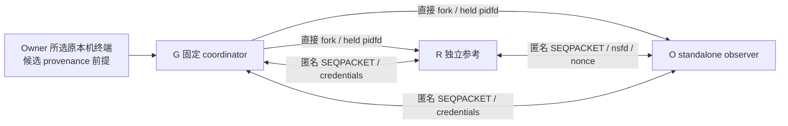

# Q2 原终端 namespace 独立参考：架构

- Authority：Owner；状态：**PROPOSED / Gate OPEN / AWAITING OWNER**。
- Scope/R/拟批准 NS1–NS2 与[需求](REQUIREMENTS.md)一致；本次仅文档。
- 原终端 provenance 与 endpoint execution integrity 是候选独立前提，未获 Owner 接受。

## 固定进程拓扑与来源锚

唯一实现是摘要绑定的 standalone collector；固定现有 interpreter 直接运行 G，G
单线程 fork R、O，不 exec 外部程序。两个 child 在 G 取得原 pidfd、完成资格并发出
SETUP 前只等固定 IPC。G 不收 caller terminal PID、输入目录、其它 FD、命令或可执行环境
覆盖，不从 container ancestor、getppid 链、boot 或 JSON namespace number 推断原终端。

图中的 T 只在将来 NS3 使用；NS2 由明确 isolated fixture 启动者替代，仅成为 fixture
reference。G 的 source/runtime/context pin 及 provenance 启动决定提供外部来源锚；
R 在这一来源下独立取得自身 kernel fd。O 的报告不能指定 R，也不能以 own 回执填 R 的
身份。G 与 R/O 都必须按固定普通身份运行；不存在 privileged reference daemon。

同一个错误容器内的 G/R/O 可能技术上全部相符：此时不能靠本机制证明 native host。
在 NS3，只有另行明确采用的 Owner 原终端 provenance 前提能将该来源解释为原终端。
若实际启动违背前提或端点执行可被替换，结果仍不能用于原终端结论；该边界不借存储
前提隐藏。技术目标是核验被指定参考与当前 O 的活体关系，不是证明全局 initial namespace。

## 固定来源表与 fd 资格

本地数据源只有下表，不读取 boot_id、mountinfo、stat、readlink 或父/祖先进程内容。
metadata/ABI 验证仅作用已经固定选择的 held fd；不枚举 `/proc` 或 ns 目录。

| 端点 | 内容/对象 | 来源绑定 |
| --- | --- | --- |
| G/R/O | `/proc/self/status` | 同一 qualified `/proc` 下唯一固定 self magiclink，得到 own process directory；单线程 status 与 own getpid 关系检查 |
| G/R/O | `/proc/self/ns/pid`、`/proc/self/ns/mnt` | 在上述 held process/ns directory 下仅跟随这两项固定 kernel magiclink，取得实际 namespace FD |
| 仅 G | `/proc/<R-fork-PID>/status`、`ns/pid`、`ns/mnt` | 数字 PID 只能取原 fork 返回值；G 持有该 child 原 pidfd且尚未 reap；process directory 及名字前后重绑定 |
| 仅 G | `/proc/<O-fork-PID>/status`、`ns/pid`、`ns/mnt` | 与 R 相同，固定另一个 direct child，不能接受调用者 PID |

先用既有 K 的 native x86_64/LP64 fd metadata 原语思想验证 `/` 与 `/proc` 的 held
no-follow directory、保护、`PROC_SUPER_MAGIC`、device、`statx` mount ID 与 ABI。
本提案不修改 K reader 或自动继承其新来源权；本 collector 自己的准确实现必须受本 A/B/C/D。
缺 libc/interface/layout 或 metadata qualification 即停止，没有通用 reader fallback。

`self` 在 procfs 已资格后，先用 no-follow metadata 确认是该 mount 的 link，仅在这一
固定名字处允许打开 process directory；不用 readlink 获取其它目标。child 数字目录直接
no-follow 打开。process/ns directory 必须同一 procfs device/mount、允许固定身份与保护；
不接受子挂载。`status` 叶用 `O_RDONLY|O_NOFOLLOW|O_CLOEXEC|O_NONBLOCK`，先检查 fd
procfs/mount/普通叶身份，再读有限 bytes；不用 `O_NOATIME`，不更改既有证据 reader。

严格解析 `Threads=1`、唯一 NStgid/NSpid 单级向量和内部预期 PID。字段从 proc mount
所对应 PID namespace 开始的语义必须由 NS1 绑定的 primary kernel/interface 来源确认，
不能只因测试输入符合格式就声称平台语义成立。完整向量缺失、多级或 scalar 不符即
BLOCKED；不得删去祖先级以适配结果。其它 status 字段可保留摘要，不升级为授权事实。
接口的 mount-relative 向量语义见 man-pages 项目的
[proc_pid_status(5)](https://man7.org/linux/man-pages/man5/proc_pid_status.5.html)；
这是接口依据，不是原机已满足 namespace/ABI 资格的证据。

仅对固定 `ns/pid`、`ns/mnt` 允许 magiclink 打开（只取 namespace handle，不读取内容），
精确使用`O_RDONLY|O_CLOEXEC|O_NONBLOCK`，仅这两leaf省略NOFOLLOW；不用O_PATH代替
可ioctl的namespace handle，不加O_NOATIME。从procfs link到nsfs handle是这两leaf
唯一允许的target transition，不要求target device/mount仍等于proc directory；其余
proc目录/叶仍必须同一procfs mount，子挂载拒绝。在FD上取得`fstat`身份、`fstatfs`
的`NSFS_MAGIC`和`NS_GET_NSTYPE`，要求分别为
pid/mnt 类型。跟随前的 link 必须来自 held qualified ns directory；FD type、ABI、errno
或 source 不明即拒绝。namespace metadata 不沿用 K regular-file/nlink 假设，不能把 nsfd
当普通证据文件或允许任意 nsfs source。比较使用同时仍 held 的 `(device,inode,type)`
身份；数字 inode、文本 `pid:[...]` 或已释放 FD 的历史 metadata 不足。
namespace handle 与类型查询接口见
[namespaces(7)](https://man7.org/linux/man-pages/man7/namespaces.7.html)和
[ioctl_nsfs(2)](https://man7.org/linux/man-pages/man2/ioctl_nsfs.2.html)，
不能由文档语义推导原 host 访问权限或实际 namespace 关系。

对 self/process/ns 名称前后重新打开同一固定对象并与原 held FD 比较；每次检查 child
路径前/后还核验原 pidfd 没有退出。所有原 pidfd/nsfd 和 proc mount 引用保持到最后一次
活体对照结束，避免已释放对象的数字复用。失败不再尝试另一 proc 路径。

## fork、PID reuse 与 IPC

G 在 fork 前设置正常 SIGCHLD 行为，禁止 SIG_IGN、SA_NOCLDWAIT 和自动 reap。child
出生后不得在 SETUP 前离开固定等待逻辑；G 用自己创建的两个 PID 调用 pidfd_open，
如果原 child 已退出，即拒绝交换成功，不用相同数字的新进程续上。G 不提前 reap，因而
子 PID 仍占用；pidfd 作为原 lifetime 引用，进程 directory/name 对照作为观察绑定，二者
用途分开。pidfd readable 不能冒充 wait status、IPC EOF 或 reference 仍活着。
fork 后 PID reuse 的 SIGCHLD/reap 条件与原 pidfd 接口见
[pidfd_open(2)](https://man7.org/linux/man-pages/man2/pidfd_open.2.html)。

G 在 fork 前只创建三个匿名 `socketpair(AF_UNIX, SOCK_SEQPACKET)`，启用 SO_PASSCRED；
fixture 的准确 launcher 只将 stdin/stdout/stderr 继承给 G；这一封闭启动合同须由准确
source及NS2资格证明，未知即BLOCKED。collector不枚举`/proc/self/fd`或无限probe来
推断absence。fork后按G已登记的有限FD表关闭所有不属于该child的对象；R/O不继承
G的process/nsfd/pidfd参考，分别打开own self来源。G↔R、G↔O是控制边，R↔O为交叉
参考边。无 filesystem socket、外部连接、转交自由 endpoint 或可加入的第三方。

每个 recvmsg 必须验证恰好一个 kernel SCM_CREDENTIALS，PID/UID/GID 与 G 原 fork
身份及固定普通 context 相同。R/O 的对端 PID 由 G 的 SETUP 绑定；G 自身身份由固定
出生/控制链绑定。socketpair 创建时 SO_PEERCRED 不是后续 child 发件身份，不用它
替代逐消息 credentials。拒绝 MSG_TRUNC/MSG_CTRUNC、多余 ancillary、unexpected FD
数量、role/counter/session/pin 不符；收到但拒绝的 FD 同样有限登记关闭。
IPC凭据/FD与SEQPACKET语义见
[unix(7)](https://man7.org/linux/man-pages/man7/unix.7.html)；
该接口依据不能替代准确endpoint、fd继承和原活体source对照。

G 从 procfs 独立取得 R/O 各自 namespace FD 后，再检查 SOURCE 帧交付的 FD，而不是
相信两 child 自报的 metadata。R/O cross exchange 的 FD 必须与各自先 held own FD
相符；G 将两个 endpoint 的 own FD 与自身参考及 direct-child namespace FD 对照。
若 O 交付的替代 FD 对象不同于 O 的实际 namespace，G 的 direct-child 对照拒绝。
同一 namespace 对象的 FD 由另一进程复制过来则不可从对象身份区分最初打开者；关系
仍真实相符，按固定代码打开 own FD 的来源诚信依赖明示 endpoint integrity 前提。
不声称排除了任意同对象 relay。端点都真实在同一 namespace 时相符是本机制要证明的
关系，不把相同 namespace 当成原终端来源证明。

## FD 生命周期与24-FD峰值

G的原procfs/process/ns directories、独立namespace与pidfd留到活体最后复查；
SOURCE交付给G的SCM_RIGHTS只是比较用duplicate，逐帧串行接收、比较后立即close，
不能将R和O两份duplicate一起长期保留。“全程held”只指下表原参考，不指所有接收副本。

| G同时常驻FD | 数量 |
| --- | --- |
| stdin/stdout/stderr | 3 |
| root、proc、G self process/ns目录、两child process/ns目录 | 8 |
| G self与两child各自pid/mnt原nsfd | 6 |
| 原R/O pidfd | 2 |
| G↔R、G↔O控制端点 | 2 |
| 合计 | **21** |

SOURCE最多暂收2个FD，G峰值23；关闭后再读取status或串行重绑定单个directory/nsfd，
通常峰值22，固定拒绝同时叠加其它临时FD，不超过24。G不保留R↔O端点。
R/O各为3stdio+4own root/proc/self/ns directory+2own nsfd+2IPC+2peer nsfd=13常驻，
至多一个status/rebind临时FD。peer nsfd须保留到第二轮比较，G_SOURCE duplicates不需。
不重开全部祖先链与原chain同时并存；所有rebind都在held parent下单个打开、比对、关闭。
socketpairs与fork的早期已登记继承FD也计入峰值，NS2须核验这段，不只计最终常驻值。

## 固定两轮交换

`session_id` 只由 SETUP 前已知的准确 artifact/source/runtime/context/fixture 摘要、
G 及两个原 fork PID、原双钟起点与固定阶段 deadline 域分离绑定，不包含尚未生成的 nonce。
R 在第5帧前一次生成 nonce_R，O 收到该帧后在第6帧前一次生成 nonce_O；没有第三个
随机 nonce，也不在 SOURCE 帧追认尚未知值。双方取得两 nonce 后另计算
`challenge_digest = SHA256(domain || session_id || nonce_R || nonce_O || role_bound_actual_objects)`，
其中两角色各自实际 pid/mnt 对象与 status 摘要按固定规范顺序编码。G 收到对应实际FD与
两轮结果后独立重算；报告绑定 session_id 与 challenge_digest，两者用途分开。
帧严格 UTF-8/JSON，拒绝重复/未知 key、bool-as-int、非规范整数、尾随数据。
FD number 不进入持久身份；帧内对象角色只与实际接收的两 held nsfd 交叉绑定。
以下总计 16 帧，不允许重发或重新挑战：

| 顺序 | 帧 | 内容及 FD |
| --- | --- | --- |
| 1–2 | G→R/O SETUP | 原 session/pins、准确两 child PID、context、双钟/阶段 deadline；无 FD |
| 3–4 | R/O→G SOURCE | own status 摘要、固定角色的 pid/mnt metadata；各恰好两 nsfd |
| 5 | R→O CHALLENGE_A | R 一次 32-byte getrandom nonce、R own status/namespace binding；两 R nsfd |
| 6 | O→R RESPONSE_A | echo R nonce、O 一次 32-byte nonce、O own binding；两 O nsfd |
| 7–8 | O→R CHALLENGE_B / R→O RESPONSE_B | 同两 nonce、准确 own/peer object binding、顺序计数；无 FD |
| 9–10 | R/O→G ROUND1_RESULT | 同 session/nonces、实际 held peer/own 对照；无 FD |
| 11–12 | G→R/O RECHECK | 原两 nonce 和原 held reference generation，不重开 session；无 FD |
| 13–14 | R/O→G ROUND2_RESULT | 重查 own status、固定名称与同一 own/peer held FD、普通身份；无 FD |
| 15–16 | G→R/O FINISH | G 自身/两 child 的 status、namespace、pidfd 活性复查通过后的固定收尾；无 FD |

FINISH 后不增加第17/18帧。R/O 各对 R↔O 端点 shutdown-write，并在原stop/EOF
deadline内真实读取peer EOF，确认全部预期帧已收齐且无额外frame，才进入固定正常退出
路径；G不持有这个peer端点，也不宣称直接看到其EOF。G在两control边各发送FINISH后
shutdown-write，直接观察G↔R/G↔O read EOF与原child wait status。cross EOF只有
`CHILD_OBSERVED_SUPPORTED_BY_PINNED_NORMAL_EXIT`来源：需准确child source pin、正常
exit code及execution integrity前提；异常退出、缺EOF、timeout或信号终止均不能作为它的证明。

G 不因 ROUND1_RESULT 提前报告通过；必须完成 G 的独立两 child namespace/status
第二次观察与两端 ROUND2_RESULT，且所有原 pidfd 仍活着。nonce 提供当前 peer 往返
关系，credentials/direct-child FD 对照提供来源关系；nonce 本身不能防止被篡改 endpoint
中继。本证明明确依赖候选 execution integrity 前提，不能声称挑战认证了任意 hostile 同 UID 程序。

## 严格封装 schema

下列 schema 固定在 NS1，不能由通用 JSON 或 caller 开关替换；每份拒绝多余/重复 key、
bool-as-int、未知版本/枚举、非规范数值/摘要、尾随数据和 bytes/caps 超界。

| 对象 | 固定 schema 与字段组 |
| --- | --- |
| artifact manifest | `local-hand-q2-namespace-reference-artifact/v1`；scope、approved_stages=`[NS1,NS2]`、R/准确A/B/C/D、固定平铺成员 name/bytes/SHA、runtime pin、context member binding、所有caps。最终artifact bytes/SHA在外部固定，不自包含自身摘要 |
| context | `local-hand-q2-namespace-reference-context/v1`；purpose=`ISOLATED_FIXTURE`、fixture/source/supervisor/audit来源摘要、Linux x86_64 LP64/interface版本、runtime摘要、准确普通UID/GID三元与完整groups、固定caps。没有PID、proc路径、命令、来源FD、boot或caller deadline |
| IPC frame | `local-hand-q2-namespace-reference-frame/v1`；固定16步中的kind/sender/receiver/counter、session_id、各步已知的pins/deadline/nonce/challenge_digest/object/status摘要；SOURCE/首次peer两FD角色表与实际ancillary对应。仅SETUP能携带G内部派生PID；不接受把这些数值倒灌为G输入 |
| result | `local-hand-q2-namespace-reference-result/v1`；scope/stage/purpose、artifact/source/runtime/context/fixture pins、session_id/challenge_digest、原双钟/阶段边界、typed来源关系/bytes/摘要、原task/FD lifetime与wait/EOF、实际usage/缺项/前提状态、有限错误及所有readiness false字段 |

result 的 stage 只允许 NS1 synthetic 或 NS2 fixture，原终端provenance状态在这两个stage
只能为 NOT_APPLICABLE/NOT_ADOPTED；不能以填一个Owner event字符串升级来源。未来NS3/NS4
若批准须形成各自准确用途/schema与绑定变更，不由本schema的自由字段预留扩权。

## 上限、停止与 evidence

[需求](REQUIREMENTS.md)的表是唯一 caps。固定两轮最多 12 次 status 读取及 40 次
namespace open/rebind；每次 read 都有剩余字节界，超界在额度内拒绝，不做额外无界 EOF
探测。每帧 4 KiB、总 16 帧；SCM FD 暂存、重复引用和 stdio 均计 24/72 FD 峰值。
no extra child/thread/exec 由固定源码及 fixture supervisor 核验，不能用 caller 承诺替代。

原双钟先于首次身份/proc 观察；20s 截止后禁止新的观察/挑战，只进入原来的 5s stop 和
5s exit/EOF/report reserve。观察提前失败/结束时，stop/EOF阶段分别使用需求所定义的
min(original phase deadline, actual phase start+5s)，只能收紧截止。G 只能向自己的两
pidfd 发固定 SIGTERM，必要时 SIGKILL；
不用数字 PID kill、process-group 扫描或任意对象 stop。fixture 既有普通 supervisor 负责
G 本身及全量原 task、RAM/CPU、退出与双 EOF 的独立资格证据；没有它就 BLOCKED，不
创建 manager/cgroup 或请求提权。deadline guard 和 pidfd_send_signal 不能证明不可中断
syscall 有绝对停止上界；任何缺实际停止/EOF 的失败保留 UNKNOWN，不刷新窗口。

G 的唯一 stdout 报告 ≤32 KiB、stderr ≤8 KiB，native 观察原件在 fixture/private 收件
记录中留存，公开只存 source pin、摘要、关系、状态和限制。collector 不创建文件或
持久 marker；receiver 的存档、kernel/native audit 或 fixture supervisor 成本另按准确
fixture 合同计费，不能说没有 audit 副作用。报告必须绑定 scope/阶段、artifact、source
D、runtime/context/fixture、原双钟、两 nonce、原进程/FD lifetime、source类型与bytes/摘要、
退出/EOF、预算和候选前提采用状态；不包含未知数据的合成通过值。

G收齐真实child wait status与自己两control IPC的直接EOF后关闭namespace/pidfd/proc
引用。G报告分别列`g_control_eof_direct`和`cross_eof_child_normal_exit_supported`，
后者不写成G独立直接观察；正常exit code只由child完成真实cross EOF的固定路径产生。
G自身exit与stdout/stderr EOF在G报告内为`NOT_OBSERVABLE_BY_G`，不得自报已退出。
外部fixture收件端用原G进程监督结果，另形成绑定G报告bytes/SHA的有限receipt，
取得G原退出和stdout/stderr EOF后才能给整套qualification完整结论。该receipt与G报告
共用40KiB输出及所有fixture成本界，不扩新collector帧或持久文件权限。发生控制丢失、
信号停止超时或报告缺失时，外部cleanup如实单列，不回填已经丢失的成功报告。

本 collector 不取 boot_id，因此没有同 boot 结论；namespace FD 是活体内核对象引用，
有效期只到本 session 最后比较及 reference 生命周期。NS4 如果需要实际 consumer，必须
另审准确 source/PID/source用途、provenance启动、held FD 传递、活性及原 deadline，不能
让另一个晚启动进程采纳 standalone O 的历史结果。原 H07 与 FS readiness 保持原状态。
